# Arquitectura ETL Open-Stage basada en DataStage

## Tabla de Contenidos

1. [Visión General](#visión-general)
2. [Arquitectura del Sistema](#arquitectura-del-sistema)
3. [Componentes Core](#componentes-core)
4. [Capas de la Arquitectura](#capas-de-la-arquitectura)
5. [Flujo de Datos](#flujo-de-datos)
6. [Mapeo DataStage → Open-Stage](#mapeo-datastage--open-stage)
7. [Ejemplos de Implementación](#ejemplos-de-implementación)
8. [Patrones de Diseño](#patrones-de-diseño)

---

## Visión General

Open-Stage es un framework ETL moderno en Python que replica la arquitectura de IBM DataStage, añadiendo capacidades de IA generativa y conectividad cloud-native. El sistema está diseñado con principios de modularidad, extensibilidad y simplicidad.

### Características Principales

- **Arquitectura basada en componentes**: Origins, Nodes, Destinations
- **Method chaining fluido**: Sintaxis declarativa para definir pipelines
- **Conectores enterprise**: PostgreSQL, BigQuery, APIs REST, CSV
- **Transformadores con IA**: Claude (Anthropic) y Gemini (Google)
- **Validaciones robustas**: Verificación de conectividad y tipos de datos
- **Extensibilidad**: Fácil creación de componentes personalizados

---

## Arquitectura del Sistema

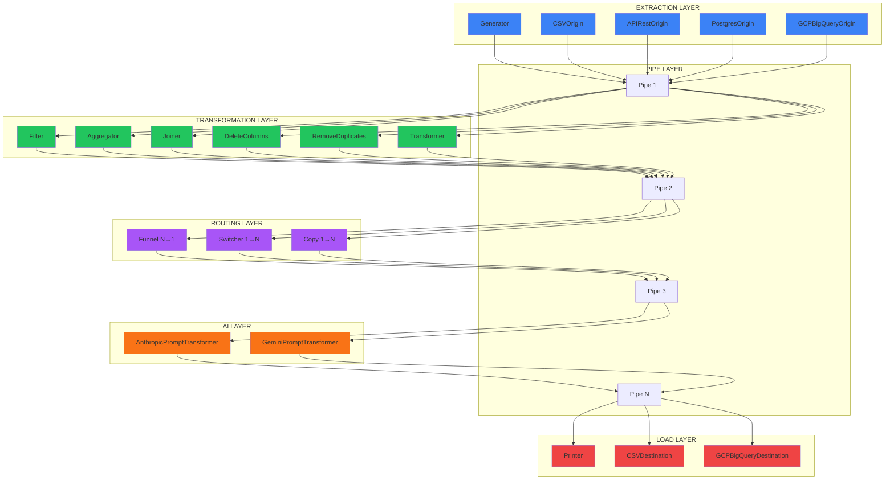

---

## Componentes Core

### Diagrama de Clases

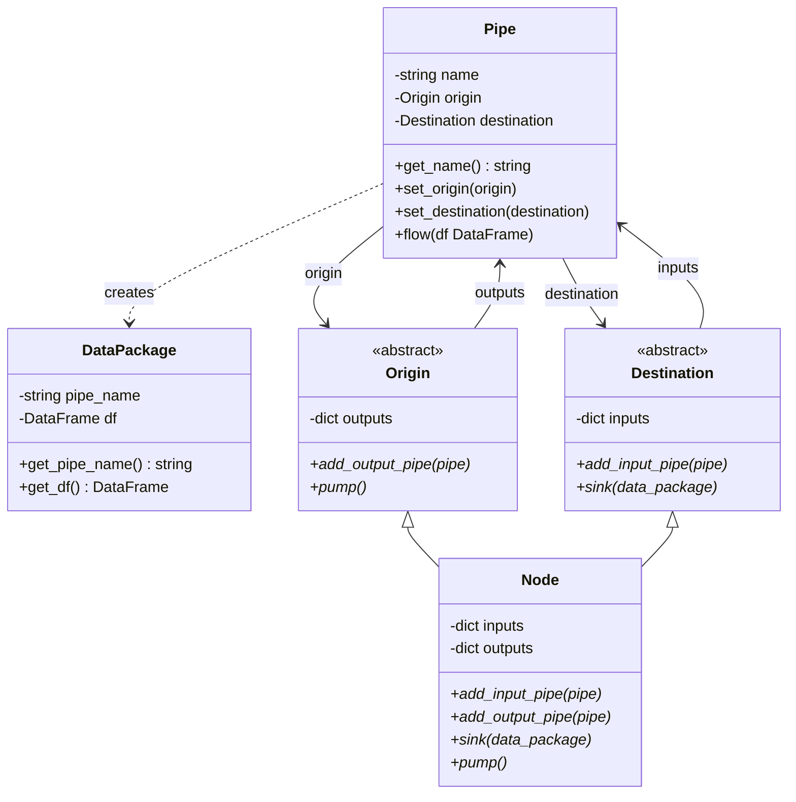

### Descripción de Componentes

#### 1. DataPackage

Encapsula datos junto con metadatos del pipe de origen.

```python
class DataPackage:
    def __init__(self, pipe_name: str, df: DataFrame):
        self.pipe_name = pipe_name
        self.df = df
```

**Responsabilidades:**
- Empaquetar DataFrame con información de trazabilidad
- Mantener referencia al pipe origen
- Facilitar debugging y logging

#### 2. Pipe

Conecta componentes y transporta datos entre ellos.

```python
class Pipe:
    def __init__(self, name: str):
        self.name = name
        self.origin = None
        self.destination = None
```

**Características:**
- Mantiene referencias bidireccionales (origin ↔ destination)
- Method chaining: `set_destination()` retorna el destination si es Node
- Flujo de datos mediante `flow(df)`

#### 3. Origin (Clase Abstracta)

Representa fuentes de datos.

**Reglas:**
- ✅ 0 entradas (no recibe datos)
- ✅ N salidas (puede enviar a múltiples destinos)
- Método `pump()` para iniciar el flujo de datos
- Método `add_output_pipe()` para conectar salidas

#### 4. Destination (Clase Abstracta)

Representa destinos de datos.

**Reglas:**
- ✅ N entradas (puede recibir de múltiples fuentes)
- ✅ 0 salidas (no envía datos)
- Método `sink(data_package)` para recibir datos
- Método `add_input_pipe()` para conectar entradas

#### 5. Node (Clase Abstracta)

Representa transformadores intermedios.

**Reglas:**
- ✅ Hereda de Origin y Destination
- ✅ N entradas y M salidas (según implementación)
- Implementa `sink()` para recibir y `pump()` para enviar
- Patrón: `sink() → transformar → pump()`

---

## Capas de la Arquitectura

### 1. Extraction Layer (Origins)

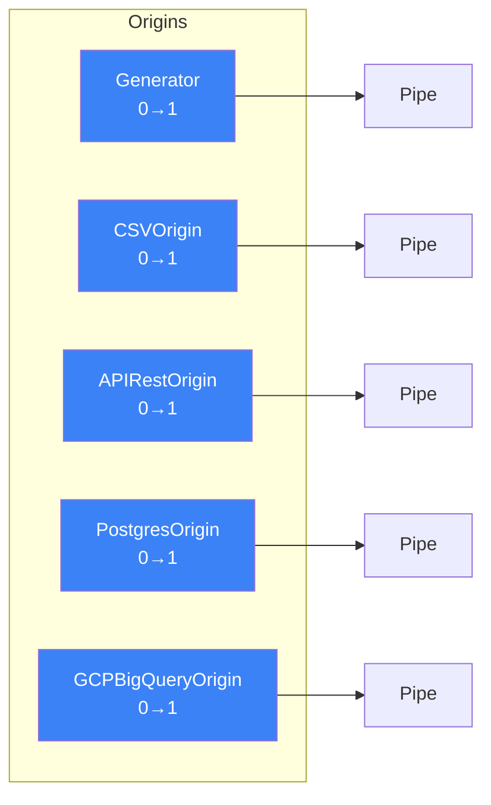

#### Componentes

| Componente | Conectividad | Descripción |
|------------|--------------|-------------|
| **Generator** | 0→1 | Genera datos secuenciales de prueba |
| **CSVOrigin** | 0→1 | Lee archivos CSV usando pandas.read_csv() |
| **APIRestOrigin** | 0→1 | Consume APIs REST con navegación JSON path |
| **PostgresOrigin** | 0→1 | Ejecuta queries SQL en PostgreSQL |
| **GCPBigQueryOrigin** | 0→1 | Ejecuta queries en Google BigQuery |

### 2. Transformation Layer (Transformers)

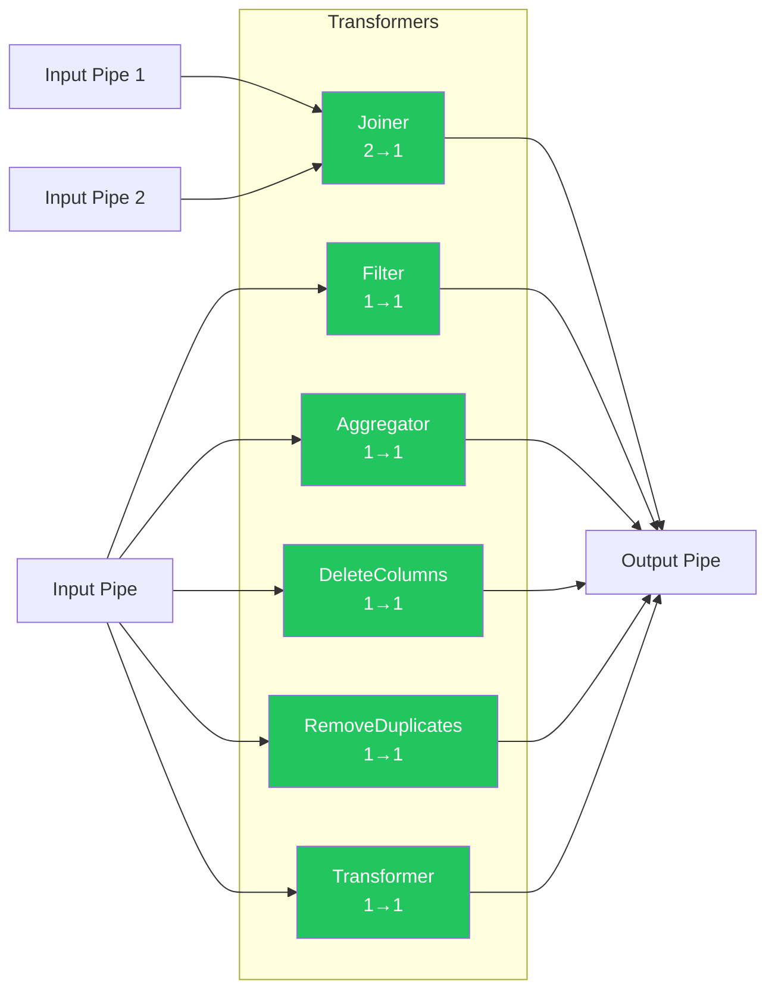

#### Componentes

| Componente | Conectividad | Operaciones |
|------------|--------------|-------------|
| **Filter** | 1→1 | `<`, `>`, `<=`, `>=`, `!=`, `=`, `in`, `not in`, `between` |
| **Aggregator** | 1→1 | `sum`, `count`, `mean`, `median`, `min`, `max`, `std`, `var`, `nunique` |
| **Joiner** | 2→1 | `left`, `right`, `inner` |
| **DeleteColumns** | 1→1 | Elimina columnas especificadas |
| **RemoveDuplicates** | 1→1 | Deduplicación por key con sorting |
| **Transformer** | 1→1 | Función Python custom |

### 3. Routing Layer (Routers)

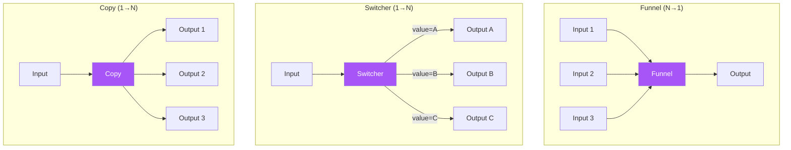

#### Componentes

| Componente | Conectividad | Descripción |
|------------|--------------|-------------|
| **Funnel** | N→1 | Combina múltiples streams (concatenación) |
| **Switcher** | 1→N | Enrutamiento condicional por valor de campo |
| **Copy** | 1→N | Duplicación de stream a múltiples destinos |

### 4. AI Transformation Layer

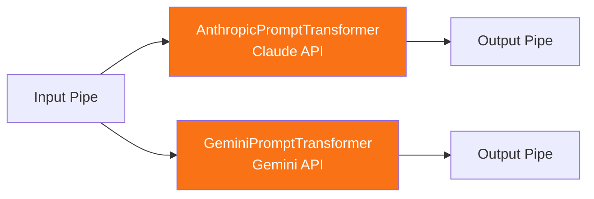

#### Componentes

| Componente | Modelo | Formato |
|------------|--------|---------|
| **AnthropicPromptTransformer** | Claude Sonnet 4.5 | CSV optimizado |
| **GeminiPromptTransformer** | Gemini 2.5 Flash | CSV con system_instruction |

**Características:**
- Transformaciones mediante prompts en lenguaje natural
- Formato CSV para optimización de tokens
- Tracking de usage (input_tokens, output_tokens)
- Manejo de truncamiento automático

### 5. Load Layer (Destinations)

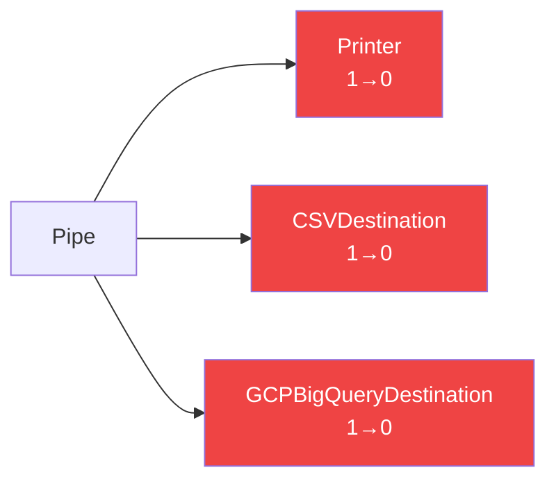

#### Componentes

| Componente | Conectividad | Descripción |
|------------|--------------|-------------|
| **Printer** | 1→0 | Visualiza datos en consola |
| **CSVDestination** | 1→0 | Escribe a archivo CSV |
| **GCPBigQueryDestination** | 1→0 | Carga a tabla BigQuery |

---

## Flujo de Datos

### Secuencia de Ejecución

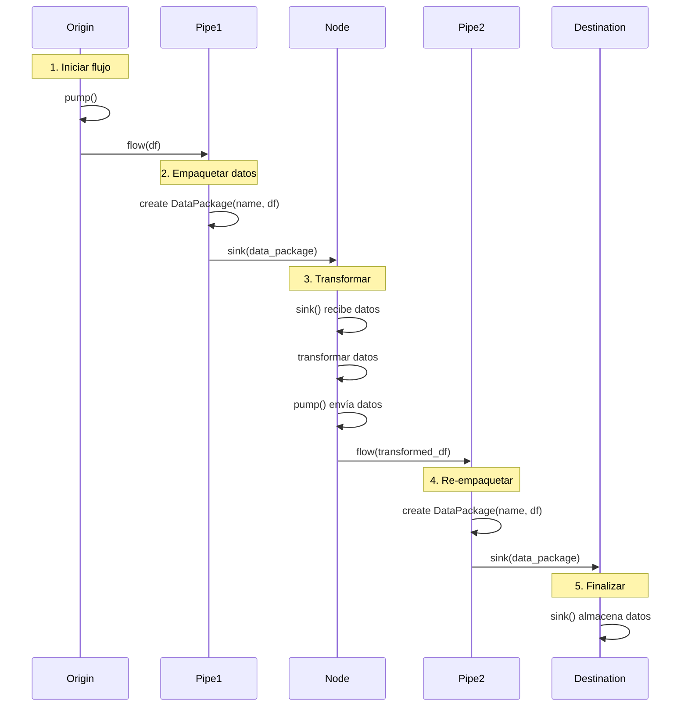

### Ejemplo de Flujo Completo

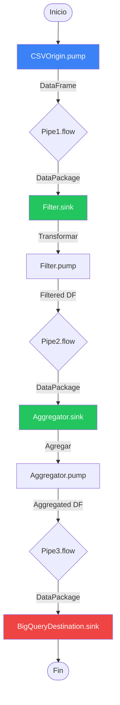

---

## Mapeo DataStage → Open-Stage

### Tabla de Equivalencias

| IBM DataStage Stage | Open-Stage Component | Notas de Implementación |
|---------------------|---------------------|-------------------------|
| **Sequential File Stage** | `CSVOrigin` / `CSVDestination` | Lectura/escritura de archivos planos con pandas |
| **Row Generator** | `Generator` | Generación de datos de prueba secuenciales |
| **DB2 Connector** | `PostgresOrigin` | Adaptable a cualquier DB con SQLAlchemy |
| **Oracle Connector** | `PostgresOrigin` | Cambiar driver a cx_Oracle |
| **SQL Server Connector** | `PostgresOrigin` | Cambiar driver a pyodbc |
| **Transformer Stage** | `Transformer` / `Filter` / `Aggregator` | Múltiples componentes especializados |
| **Funnel Stage** | `Funnel` | Concatenación de múltiples inputs |
| **Switch Stage** | `Switcher` | Enrutamiento condicional por valores |
| **Copy Stage** | `Copy` | Duplicación a múltiples targets |
| **Join Stage** | `Joiner` | Joins SQL-like (left, right, inner) |
| **Aggregator Stage** | `Aggregator` | Operaciones GROUP BY |
| **Remove Duplicates Stage** | `RemoveDuplicates` | Deduplicación con sorting |
| **Column Generator** | `Transformer` (custom function) | Generación de columnas derivadas |
| **Filter Stage** | `Filter` | 9 operaciones de filtrado |
| **Sort Stage** | `Transformer` (custom function) | Ordenamiento con pandas |
| **Peek Stage** | `Printer` | Visualización de datos |
| **BigQuery Connector** | `GCPBigQueryOrigin` / `GCPBigQueryDestination` | Integración nativa con GCP |
| **REST API Stage** | `APIRestOrigin` | Consumo de APIs con requests |
| **Lookup Stage** | `Joiner` + caching | Join optimizado para lookups |

### Diferencias Clave

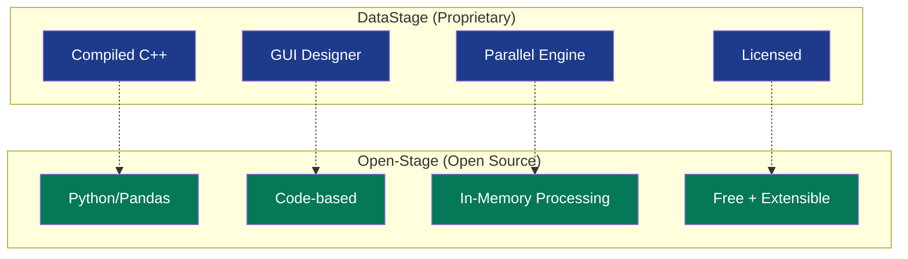

---

## Ejemplos de Implementación

### Ejemplo 1: Pipeline Simple

**Descripción:** CSV → Filter → BigQuery

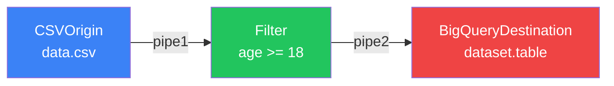

**Código:**

```python
from src.core.common import CSVOrigin, Filter
from src.google.cloud import GCPBigQueryDestination
from src.core.base import Pipe

# Componentes
csv_origin = CSVOrigin("reader", filepath_or_buffer="data.csv")
pipe1 = Pipe("pipe1")
filter_node = Filter("adults", "age", ">=", 18)
pipe2 = Pipe("pipe2")
bq_dest = GCPBigQueryDestination(
    name="writer",
    project_id="my-project",
    dataset="analytics",
    table="users_adults",
    write_disposition="WRITE_TRUNCATE"
)

# Conectar (method chaining)
csv_origin.add_output_pipe(pipe1).set_destination(filter_node)
filter_node.add_output_pipe(pipe2).set_destination(bq_dest)

# Ejecutar
csv_origin.pump()
```

### Ejemplo 2: Pipeline con Split y Merge

**Descripción:** BigQuery → Switcher → 3 paths → Funnel → Copy → [CSV + Aggregator]

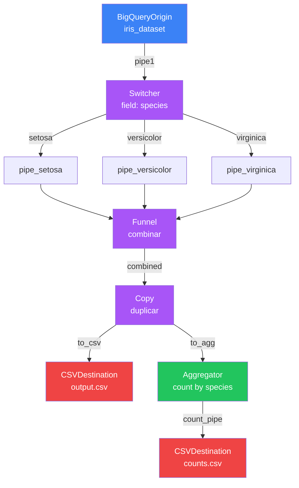

**Código:**

```python
# Origin
bq_origin = GCPBigQueryOrigin(
    name="iris_reader",
    project_id="my-project",
    query="SELECT * FROM `dataset.iris`"
)
pipe1 = Pipe("pipe1")

# Switcher
switcher = Switcher(
    name="router",
    field="species",
    mapping={
        "setosa": "p_setosa",
        "versicolor": "p_versicolor",
        "virginica": "p_virginica"
    }
)

# Pipes para cada especie
p_setosa = Pipe("p_setosa")
p_versicolor = Pipe("p_versicolor")
p_virginica = Pipe("p_virginica")

# Funnel
funnel = Funnel("combiner")
pipe_combined = Pipe("combined")

# Copy
copy = Copy("splitter")
pipe_csv = Pipe("to_csv")
pipe_agg = Pipe("to_agg")

# Destinations
csv_dest = CSVDestination("writer", path_or_buf="output.csv", index=False)
aggregator = Aggregator("counter", "species", "count", "count")
pipe_count = Pipe("count_pipe")
csv_count = CSVDestination("count_writer", path_or_buf="counts.csv", index=False)

# Conectar
bq_origin.add_output_pipe(pipe1).set_destination(switcher)
switcher.add_output_pipe(p_setosa).set_destination(funnel)
switcher.add_output_pipe(p_versicolor).set_destination(funnel)
switcher.add_output_pipe(p_virginica).set_destination(funnel)
funnel.add_output_pipe(pipe_combined).set_destination(copy)
copy.add_output_pipe(pipe_csv).set_destination(csv_dest)
copy.add_output_pipe(pipe_agg).set_destination(aggregator)
aggregator.add_output_pipe(pipe_count).set_destination(csv_count)

# Ejecutar
bq_origin.pump()
```

### Ejemplo 3: Pipeline con IA

**Descripción:** BigQuery → Claude AI → BigQuery

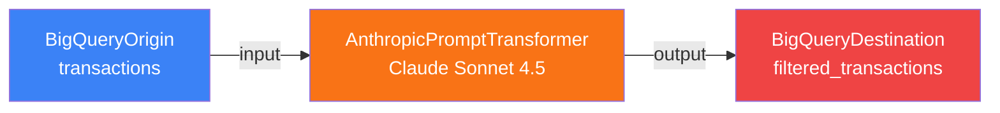

**Código:**

```python
from src.anthropic.claude import AnthropicPromptTransformer

# Origin
bq_origin = GCPBigQueryOrigin(
    name="transactions_reader",
    project_id="my-project",
    query="SELECT * FROM `dataset.transactions` WHERE date >= '2025-01-01'"
)
pipe1 = Pipe("input")

# AI Transformer
claude = AnthropicPromptTransformer(
    name="ai_transformer",
    model="claude-sonnet-4-5-20250929",
    api_key=ANTHROPIC_API_KEY,
    prompt="""Filter only high-risk transactions and add a fraud_score column.
    High-risk criteria:
    - Amount > $10,000
    - Foreign country transactions
    - Multiple transactions in short time
    Add fraud_score: LOW, MEDIUM, HIGH""",
    max_tokens=16000
)

pipe2 = Pipe("output")

# Destination
bq_dest = GCPBigQueryDestination(
    name="writer",
    project_id="my-project",
    dataset="fraud_detection",
    table="high_risk_transactions",
    write_disposition="WRITE_TRUNCATE"
)

# Conectar
bq_origin.add_output_pipe(pipe1).set_destination(claude)
claude.add_output_pipe(pipe2).set_destination(bq_dest)

# Ejecutar
bq_origin.pump()
```

### Ejemplo 4: Pipeline Complejo con Joins

**Descripción:** Multi-source Join + Aggregation

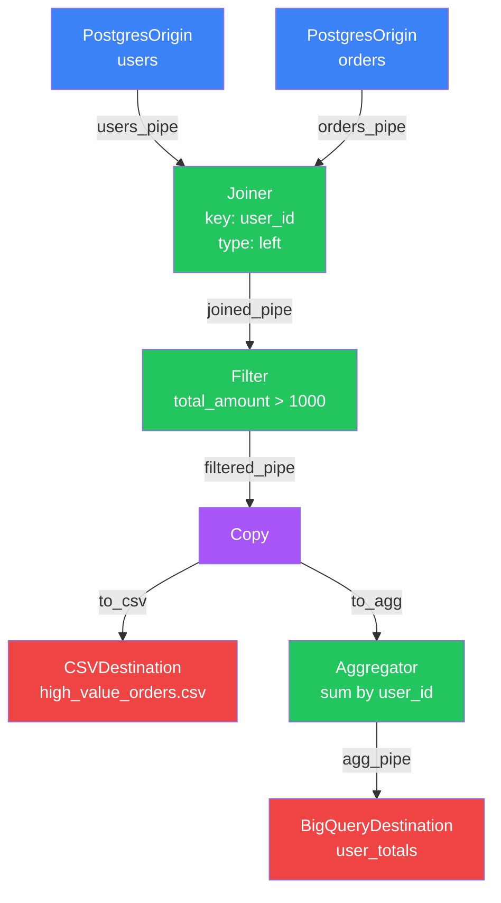

**Código:**

```python
# Origins
users_origin = PostgresOrigin(
    name="users_reader",
    host="localhost",
    database="ecommerce",
    user="postgres",
    password="password",
    query="SELECT user_id, name, email FROM users WHERE active = true"
)

orders_origin = PostgresOrigin(
    name="orders_reader",
    host="localhost",
    database="ecommerce",
    user="postgres",
    password="password",
    query="SELECT order_id, user_id, total_amount, order_date FROM orders"
)

users_pipe = Pipe("users_pipe")
orders_pipe = Pipe("orders_pipe")

# Joiner
joiner = Joiner(
    name="join_users_orders",
    left="users_pipe",
    right="orders_pipe",
    key="user_id",
    join_type="left"
)

joined_pipe = Pipe("joined_pipe")

# Filter
filter_node = Filter("high_value", "total_amount", ">", 1000)
filtered_pipe = Pipe("filtered_pipe")

# Copy
copy = Copy("splitter")
to_csv = Pipe("to_csv")
to_agg = Pipe("to_agg")

# Aggregator
aggregator = Aggregator(
    name="sum_by_user",
    key="user_id",
    agg_field_name="total_spent",
    agg_type="sum",
    field_to_agg="total_amount"
)
agg_pipe = Pipe("agg_pipe")

# Destinations
csv_dest = CSVDestination("csv_writer", path_or_buf="high_value_orders.csv", index=False)
bq_dest = GCPBigQueryDestination(
    name="bq_writer",
    project_id="my-project",
    dataset="analytics",
    table="user_totals",
    write_disposition="WRITE_APPEND"
)

# Conectar
users_origin.add_output_pipe(users_pipe).set_destination(joiner)
orders_origin.add_output_pipe(orders_pipe).set_destination(joiner)
joiner.add_output_pipe(joined_pipe).set_destination(filter_node)
filter_node.add_output_pipe(filtered_pipe).set_destination(copy)
copy.add_output_pipe(to_csv).set_destination(csv_dest)
copy.add_output_pipe(to_agg).set_destination(aggregator)
aggregator.add_output_pipe(agg_pipe).set_destination(bq_dest)

# Ejecutar (pump de ambos origins)
users_origin.pump()
orders_origin.pump()
```

---

## Patrones de Diseño

### 1. Builder Pattern (Method Chaining)

```python
# Construcción fluida de pipelines
origin \
    .add_output_pipe(pipe1) \
    .set_destination(transformer) \
    .add_output_pipe(pipe2) \
    .set_destination(destination)
```

**Ventajas:**
- Sintaxis declarativa y legible
- Reduce boilerplate code
- Facilita refactoring

### 2. Pipeline Pattern

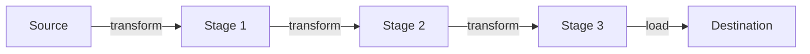

**Implementación:**

```python
# Cada stage es independiente y testeable
def stage1(df):
    return df[df['age'] > 18]

def stage2(df):
    df['category'] = df['amount'].apply(lambda x: 'high' if x > 1000 else 'low')
    return df

def stage3(df):
    return df.groupby('category').agg({'amount': 'sum'})
```

### 3. Observer Pattern (DataPackage)

El `DataPackage` encapsula el estado y notifica a los componentes downstream:

```python
class Pipe:
    def flow(self, df: DataFrame) -> None:
        # Observer: notifica al destination
        data_package = DataPackage(self.name, df)
        self.destination.sink(data_package)
```

### 4. Strategy Pattern (Transformers)

Diferentes estrategias de transformación intercambiables:

```python
# Estrategia 1: Filtrado
Filter("name", "age", ">=", 18)

# Estrategia 2: Agregación
Aggregator("name", "user_id", "total", "sum", "amount")

# Estrategia 3: Custom
Transformer("name", lambda df: df.drop_duplicates())
```

### 5. Factory Pattern (Component Creation)

```python
class ComponentFactory:
    @staticmethod
    def create_origin(type: str, **kwargs):
        if type == 'csv':
            return CSVOrigin(**kwargs)
        elif type == 'postgres':
            return PostgresOrigin(**kwargs)
        elif type == 'bigquery':
            return GCPBigQueryOrigin(**kwargs)
        # ...
```

---

## Mejores Prácticas

### 1. Nomenclatura de Componentes

```python
# ✅ Bueno: Nombres descriptivos
users_origin = CSVOrigin("users_reader", filepath_or_buffer="users.csv")
adult_filter = Filter("adults_only", "age", ">=", 18)
total_aggregator = Aggregator("sum_by_category", "category", "total", "sum", "amount")

# ❌ Malo: Nombres genéricos
origin1 = CSVOrigin("o1", filepath_or_buffer="users.csv")
filter1 = Filter("f1", "age", ">=", 18)
agg1 = Aggregator("a1", "category", "total", "sum", "amount")
```

### 2. Nomenclatura de Pipes

```python
# ✅ Bueno: Describe el flujo de datos
users_to_filter = Pipe("users_to_filter")
filtered_to_aggregator = Pipe("filtered_to_aggregator")
aggregated_to_bigquery = Pipe("aggregated_to_bigquery")

# ❌ Malo: Nombres genéricos
pipe1 = Pipe("pipe1")
pipe2 = Pipe("pipe2")
pipe3 = Pipe("pipe3")
```

### 3. Manejo de Errores

```python
# ✅ Bueno: Try-catch en componentes críticos
try:
    csv_origin = CSVOrigin("reader", filepath_or_buffer="data.csv", encoding="utf-8")
    csv_origin.pump()
except FileNotFoundError:
    print("Error: Archivo no encontrado")
except pd.errors.ParserError:
    print("Error: Error al parsear CSV")
```

### 4. Validaciones Tempranas

```python
# ✅ Bueno: Validar en constructor
class Filter(Node):
    def __init__(self, name: str, field: str, condition: str, value):
        # Validar condición antes de ejecutar
        valid_conditions = ['<', '>', '<=', '>=', '!=', '=', 'in', 'not in', 'between']
        if condition not in valid_conditions:
            raise ValueError(f"Invalid condition: {condition}")
```

### 5. Logging Detallado

```python
# ✅ Bueno: Logs informativos en cada etapa
print(f"Filter '{self.name}' processing {len(df)} rows")
print(f"Filter applied: {self.field} {self.condition} {self.value}")
print(f"Result: {len(filtered_df)} rows remaining")
```

### 6. Testing

```python
import unittest
from src.core.common import Filter
from src.core.base import Pipe
import pandas as pd

class TestFilter(unittest.TestCase):
    def test_filter_greater_than(self):
        # Crear datos de prueba
        df = pd.DataFrame({
            'name': ['Alice', 'Bob', 'Charlie'],
            'age': [25, 17, 30]
        })
        
        # Crear componente
        filter_node = Filter("adults", "age", ">=", 18)
        
        # Simular sink
        from src.core.base import DataPackage
        data_package = DataPackage("test_pipe", df)
        filter_node.sink(data_package)
        
        # Validar resultado (requiere capturar output de pump)
        # ...
```

---

## Arquitectura de Despliegue

### Opción 1: Ejecución Local

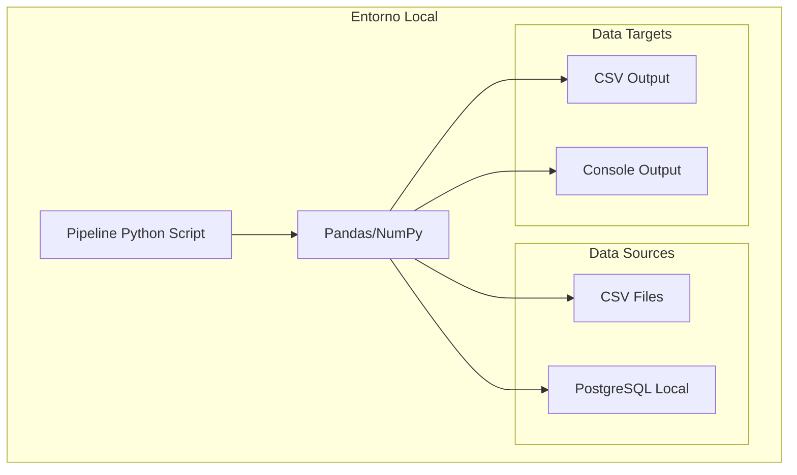

**Caso de uso:**
- Desarrollo y testing
- Pipelines pequeños (<10GB)
- Prototipado rápido

### Opción 2: Cloud Serverless (Cloud Functions)

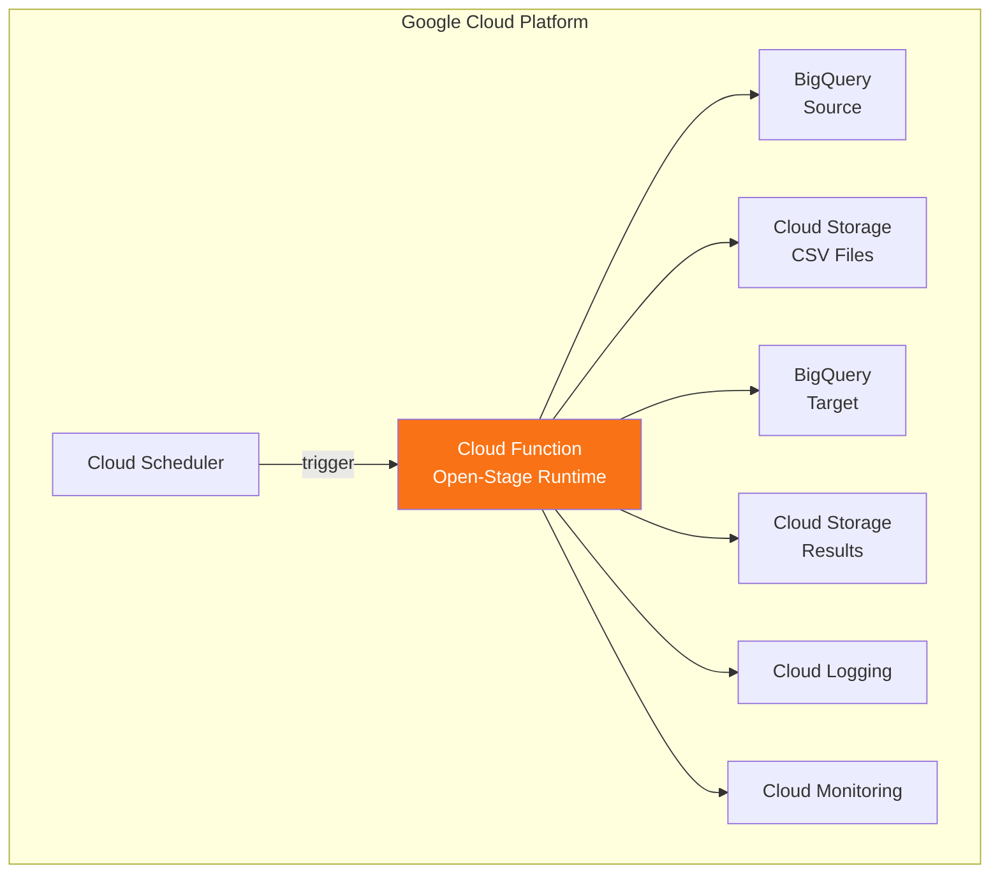

**Caso de uso:**
- Pipelines programados
- Procesamiento batch (<9 min ejecución)
- Escalamiento automático

### Opción 3: Kubernetes (Producción)

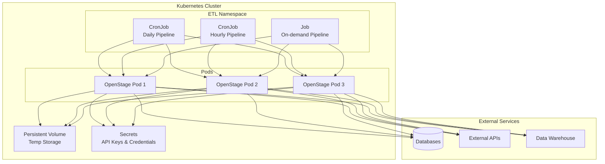

**Caso de uso:**
- Pipelines largos (>9 min)
- Alta disponibilidad
- Procesamiento paralelo
- Producción enterprise

### Opción 4: Airflow Orchestration

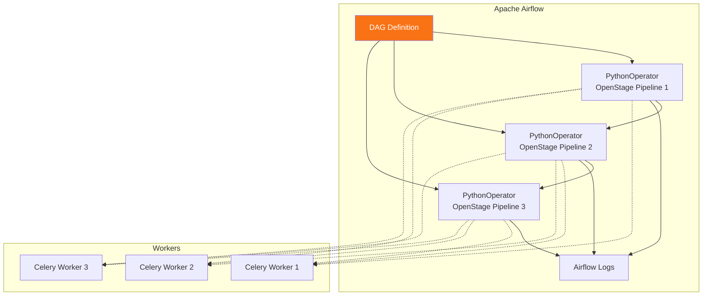

**Caso de uso:**
- Orquestación compleja
- Dependencias entre pipelines
- Monitoring avanzado
- SLAs y alertas

---

## Extensibilidad

### Crear un Nuevo Origin

```python
from src.core.base import Origin, Pipe
import pandas as pd

class MongoDBOrigin(Origin):
    def __init__(self, name: str, connection_string: str, database: str, 
                 collection: str, query: dict = None):
        super().__init__()
        self.name = name
        self.connection_string = connection_string
        self.database = database
        self.collection = collection
        self.query = query or {}
        
    def add_output_pipe(self, pipe: Pipe) -> Pipe:
        if len(self.outputs.keys()) == 0:
            self.outputs[pipe.get_name()] = pipe
            pipe.set_origin(self)
            return pipe
        else:
            raise ValueError(f"MongoDBOrigin '{self.name}' can only have 1 output")
    
    def pump(self) -> None:
        try:
            from pymongo import MongoClient
            
            # Conectar a MongoDB
            client = MongoClient(self.connection_string)
            db = client[self.database]
            collection = db[self.collection]
            
            # Ejecutar query
            cursor = collection.find(self.query)
            
            # Convertir a DataFrame
            df = pd.DataFrame(list(cursor))
            
            print(f"MongoDBOrigin '{self.name}' retrieved {len(df)} documents")
            
            # Enviar datos
            if len(self.outputs) > 0:
                output_pipe = list(self.outputs.values())[0]
                output_pipe.flow(df)
            
        except Exception as e:
            print(f"Error: MongoDBOrigin '{self.name}' failed: {str(e)}")
```

### Crear un Nuevo Transformer

```python
from src.core.base import Node, Pipe, DataPackage
import pandas as pd

class PivotTransformer(Node):
    def __init__(self, name: str, index: str, columns: str, values: str, 
                 aggfunc: str = 'sum'):
        super().__init__()
        self.name = name
        self.index = index
        self.columns = columns
        self.values = values
        self.aggfunc = aggfunc
        self.received_df = None
        
    def add_input_pipe(self, pipe: Pipe) -> None:
        if len(self.inputs.keys()) == 0:
            self.inputs[pipe.get_name()] = pipe
        else:
            raise ValueError(f"PivotTransformer '{self.name}' can only have 1 input")
    
    def add_output_pipe(self, pipe: Pipe) -> Pipe:
        if len(self.outputs.keys()) == 0:
            self.outputs[pipe.get_name()] = pipe
            pipe.set_origin(self)
            return pipe
        else:
            raise ValueError(f"PivotTransformer '{self.name}' can only have 1 output")
    
    def sink(self, data_package: DataPackage) -> None:
        print(f"PivotTransformer '{self.name}' received data")
        self.received_df = data_package.get_df()
        self.pump()
    
    def pump(self) -> None:
        if self.received_df is None or len(self.outputs) == 0:
            return
        
        try:
            # Realizar pivot
            pivoted_df = self.received_df.pivot_table(
                index=self.index,
                columns=self.columns,
                values=self.values,
                aggfunc=self.aggfunc
            ).reset_index()
            
            print(f"PivotTransformer '{self.name}' completed pivot")
            print(f"  - Input shape: {self.received_df.shape}")
            print(f"  - Output shape: {pivoted_df.shape}")
            
            # Enviar resultado
            output_pipe = list(self.outputs.values())[0]
            output_pipe.flow(pivoted_df)
            
        except Exception as e:
            print(f"Error: PivotTransformer '{self.name}' failed: {str(e)}")
        
        self.received_df = None
```

---

## Monitoreo y Observabilidad

### Métricas Clave

```python
import time
from datetime import datetime

class MetricsCollector:
    def __init__(self):
        self.metrics = {
            'pipeline_start': None,
            'pipeline_end': None,
            'stages': []
        }
    
    def start_pipeline(self):
        self.metrics['pipeline_start'] = datetime.now()
    
    def end_pipeline(self):
        self.metrics['pipeline_end'] = datetime.now()
        duration = (self.metrics['pipeline_end'] - self.metrics['pipeline_start']).total_seconds()
        print(f"Pipeline completed in {duration:.2f} seconds")
    
    def log_stage(self, stage_name: str, rows_in: int, rows_out: int, duration: float):
        self.metrics['stages'].append({
            'name': stage_name,
            'rows_in': rows_in,
            'rows_out': rows_out,
            'duration': duration,
            'throughput': rows_out / duration if duration > 0 else 0
        })
```

### Dashboard de Monitoreo

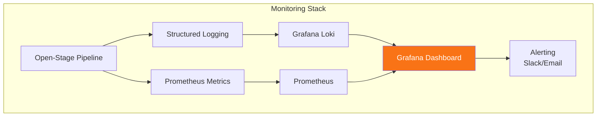

### Ejemplo de Logging Estructurado

```python
import logging
import json

class StructuredLogger:
    def __init__(self, pipeline_name: str):
        self.logger = logging.getLogger(pipeline_name)
        self.pipeline_name = pipeline_name
    
    def log_event(self, event_type: str, component: str, **kwargs):
        log_entry = {
            'timestamp': datetime.now().isoformat(),
            'pipeline': self.pipeline_name,
            'event_type': event_type,
            'component': component,
            **kwargs
        }
        self.logger.info(json.dumps(log_entry))

# Uso
logger = StructuredLogger("sales_pipeline")
logger.log_event(
    'component_start',
    'filter',
    component_name='adult_filter',
    input_rows=1000
)
```

---

## Troubleshooting

### Problemas Comunes

#### 1. Pipe no configurado

**Error:**
```
Warning: Filter 'my_filter' has no output pipe configured
```

**Solución:**
```python
# ✅ Asegurarse de conectar output pipe
filter_node.add_output_pipe(output_pipe).set_destination(destination)
```

#### 2. Columna no encontrada

**Error:**
```
ValueError: Filter 'my_filter': field 'age' not found in DataFrame columns
```

**Solución:**
```python
# ✅ Validar columnas antes de filtrar
print(f"Available columns: {list(df.columns)}")
# Usar el nombre correcto de columna
filter_node = Filter("adults", "Age", ">=", 18)  # Nota la mayúscula
```

#### 3. Tipos incompatibles en Join

**Error:**
```
ValueError: You are trying to merge on int64 and object columns
```

**Solución:**
```python
# ✅ Convertir tipos antes del join
def type_converter(df):
    df['user_id'] = df['user_id'].astype(str)
    return df

transformer = Transformer("type_fix", type_converter)
```

#### 4. Memoria insuficiente

**Error:**
```
MemoryError: Unable to allocate array
```

**Solución:**
```python
# ✅ Procesar en chunks
def process_in_chunks(file_path, chunk_size=10000):
    chunks = pd.read_csv(file_path, chunksize=chunk_size)
    for chunk in chunks:
        # Procesar cada chunk
        process_chunk(chunk)
```

#### 5. Credenciales de BigQuery inválidas

**Error:**
```
google.auth.exceptions.DefaultCredentialsError
```

**Solución:**
```python
# ✅ Configurar credentials explícitamente
import os
os.environ['GOOGLE_APPLICATION_CREDENTIALS'] = '/path/to/credentials.json'

# O usar credentials_path en el componente
bq_origin = GCPBigQueryOrigin(
    name="reader",
    project_id="my-project",
    query="SELECT * FROM table",
    credentials_path="/path/to/credentials.json"
)
```

---

## Roadmap y Evolución

### Features Planeados

```mermaid
gantt
    title Open-Stage Roadmap 2025
    dateFormat YYYY-MM
    section Phase 1
    MongoDB Connector           :2025-01, 1M
    MySQL Connector            :2025-01, 1M
    Excel Origin/Destination   :2025-02, 1M
    
    section Phase 2
    Kafka Consumer/Producer    :2025-03, 2M
    S3 Origin/Destination      :2025-03, 2M
    Snowflake Connector        :2025-04, 1M
    
    section Phase 3
    OpenAI Transformer         :2025-05, 1M
    DeepSeek Transformer       :2025-05, 1M
    Sort Component             :2025-06, 1M
    
    section Phase 4
    Pivot/Unpivot Components   :2025-07, 1M
    Window Functions           :2025-07, 1M
    Parquet Support            :2025-08, 1M
```

### Arquitectura Futura

```mermaid
graph TB
    subgraph "Open-Stage 2.0"
        Core[Core Engine]
        
        subgraph "Connectors"
            DB[Database Connectors<br/>MySQL, MongoDB, Oracle]
            Cloud[Cloud Connectors<br/>S3, Snowflake, Azure]
            Stream[Streaming<br/>Kafka, Kinesis, Pub/Sub]
        end
        
        subgraph "AI Models"
            Claude[Claude 4]
            Gemini[Gemini 2.5]
            GPT[GPT-4o]
            DeepSeek[DeepSeek]
        end
        
        subgraph "Advanced Features"
            Parallel[Parallel Processing]
            Cache[Intelligent Caching]
            Opt[Query Optimization]
        end
        
        Core --> DB & Cloud & Stream
        Core --> Claude & Gemini & GPT & DeepSeek
        Core --> Parallel & Cache & Opt
    end
    
    style Core fill:#f97316,color:#fff
```

---

## Conclusión

Open-Stage es una plataforma ETL moderna que combina:

- **Arquitectura probada** de DataStage
- **Simplicidad** de Python y Pandas
- **Extensibilidad** mediante componentes modulares
- **IA generativa** para transformaciones inteligentes
- **Cloud-native** con soporte GCP BigQuery
- **Open source** y gratuito

### Comparativa Final

| Característica | IBM DataStage | Open-Stage |
|----------------|---------------|------------|
| **Lenguaje** | C++/DataStage DSL | Python |
| **Licencia** | Propietaria ($$) | Open Source (Gratis) |
| **Curva de aprendizaje** | Alta | Baja |
| **Extensibilidad** | Limitada | Total |
| **IA Generativa** | No | Sí (Claude, Gemini) |
| **Cloud Native** | Parcial | Completo |
| **Testing** | Complejo | Simple (unittest) |
| **Version Control** | Difícil | Git-friendly |
| **CI/CD** | Complejo | Estándar (GitHub Actions) |

---

## Referencias

- **Repositorio:** `github.com/your-org/open-stage`
- **Documentación API:** `docs.open-stage.io`
- **Ejemplos:** `github.com/your-org/open-stage-examples`
- **Community:** `discord.gg/open-stage`

---

**Versión:** 1.0.0  
**Última actualización:** Octubre 2025  
**Autor:** Equipo Open-Stage