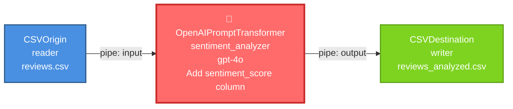
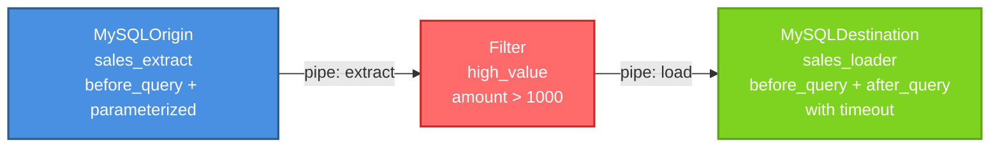
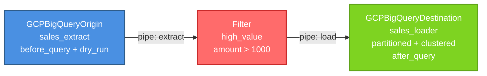
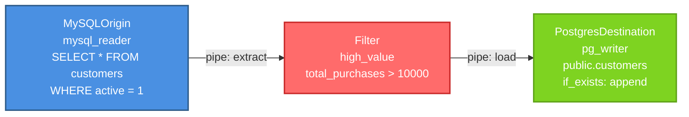

# Open-Stage

> A modern, AI-powered ETL framework for enterprise data workflows

[](https://opensource.org/licenses/MIT)
[](https://www.python.org/downloads/)
[]()

Open-Stage is an enterprise-grade ETL (Extract, Transform, Load) platform built in Python, inspired by IBM DataStage. It implements a pipes and filters architecture that enables the creation of modular, scalable data processing pipelines with multi-model generative AI capabilities.

## ✨ Key Features

- 🧩 **29 Modular Components** (5 base + 24 specialized)
- 🔌 **Multiple Data Sources**: CSV, MySQL, PostgreSQL, BigQuery, REST APIs
- 🤖 **AI-Powered Transformations**: OpenAI (GPT-4o, GPT-4-Turbo), Claude (Anthropic), Gemini (Google), DeepSeek
- ✅ **Robust Validations** and intelligent error handling
- ⛓️ **Method Chaining** for fluent syntax
- 🔧 **Extensible Architecture** by provider and component type
- 📜 **Open Source** under MIT License
- 🚀 **Advanced BigQuery Support** with pre/post queries, partitioning, and clustering
- 🚀 **Advanced PostgreSQL Support** with pre/post queries, timeout, and parameterized queries ✨ **v2.4**
- 🚀 **Advanced MySQL Support** with pre/post queries, timeout, and parameterized queries ✨ **NEW v2.4**


## 🚀 Quick Start

### Installation
```bash
pip install -r requirements.txt
```

### Simple Pipeline Example
```python
from src.core.common import CSVOrigin, Filter, CSVDestination
from src.core.base import Pipe

# Create components
csv_origin = CSVOrigin("reader", filepath_or_buffer="data.csv")
filter_node = Filter("adults", "age", ">=", 18)
csv_dest = CSVDestination("writer", path_or_buf="output.csv", index=False)

# Create pipes
pipe1 = Pipe("pipe1")
pipe2 = Pipe("pipe2")

# Connect pipeline with method chaining
csv_origin.add_output_pipe(pipe1).set_destination(filter_node)
filter_node.add_output_pipe(pipe2).set_destination(csv_dest)

# Execute
csv_origin.pump()
```

## 📦 Project Structure
```
project/
├── LICENSE                    
├── README.md
├── requirements.txt
├── src/
│   ├── core/
│   │   ├── __init__.py
│   │   ├── base.py                    
│   │   │   ├── DataPackage           
│   │   │   ├── Pipe                  
│   │   │   ├── Origin                
│   │   │   ├── Destination           
│   │   │   └── Node                  
│   │   └── common.py                  
│   │       ├── CSVOrigin             
│   │       ├── APIRestOrigin         
│   │       ├── Printer               
│   │       ├── CSVDestination        
│   │       ├── Funnel                
│   │       ├── Switcher              
│   │       ├── Copy                  
│   │       ├── Filter                
│   │       ├── Generator                
│   │       ├── OpenOrigin                
│   │       ├── Aggregator            
│   │       ├── DeleteColumns         
│   │       ├── RemoveDuplicates      
│   │       ├── Joiner                
│   │       └── Transformer           
│   ├── postgres/
│   │   ├── __init__.py
│   │   └── common.py                  
│   │       ├── PostgresOrigin        ✨ ENHANCED v2.4
│   │       └── PostgresDestination   ✨ ENHANCED v2.4
│   ├── mysql/
│   │   ├── __init__.py
│   │   └── common.py
│   │       ├── MySQLOrigin           ✨ ENHANCED v2.4
│   │       └── MySQLDestination      ✨ ENHANCED v2.4
│   ├── google/
│   │   ├── __init__.py
│   │   ├── cloud.py                   
│   │   │   ├── GCPBigQueryOrigin     
│   │   │   └── GCPBigQueryDestination 
│   │   └── gemini.py                  
│   │       └── GeminiPromptTransformer 
│   ├── anthropic/
│   │   ├── __init__.py
│   │   └── claude.py                  
│   │       └── AnthropicPromptTransformer 
│   ├── deepseek/
│   │   ├── __init__.py
│   │   └── deepseek.py                
│   │       └── DeepSeekPromptTransformer 
│   └── open_ai/
│       ├── __init__.py
│       └── chat_gpt.py                
│           └── OpenAIPromptTransformer 
```

## 🗃️ Architecture

### Base Classes

Open-Stage is built on 5 fundamental classes:

1. **DataPackage**: Encapsulates data and metadata
2. **Pipe**: Connects components and transports data
3. **Origin** (0→1): Abstract class for data sources
4. **Destination** (1→0): Abstract class for data sinks
5. **Node**: Abstract class for transformers (inherits from Origin and Destination)

### Class Diagram


### Component Categories

#### 🔵 Origins (Data Sources) - 0→1

| Component | Description | Advanced Features |
|-----------|-------------|-------------------|
| `Generator` | Generates sequential numeric data | - |
| `CSVOrigin` | Reads CSV files | - |
| `APIRestOrigin` | Consumes REST APIs | - |
| `MySQLOrigin` | Queries MySQL databases | ✨ **v2.4**: before_query, after_query, table, max_results, timeout, query_parameters |
| `PostgresOrigin` | Queries PostgreSQL databases | ✨ **v2.4**: before_query, after_query, table, max_results, timeout, query_parameters |
| `GCPBigQueryOrigin` | Queries Google BigQuery | ✨ before_query, after_query, dry_run, partitioning |
| `OpenOrigin` | Takes any DataFrame | - |


#### 🟢 Destinations (Data Sinks) - 1→0

| Component | Description | Advanced Features |
|-----------|-------------|-------------------|
| `Printer` | Displays data to console | - |
| `CSVDestination` | Writes CSV files | - |
| `MySQLDestination` | Writes data to MySQL | ✨ **v2.4**: before_query, after_query, timeout |
| `PostgresDestination` | Writes data to PostgreSQL | ✨ **v2.4**: before_query, after_query, timeout |
| `GCPBigQueryDestination` | Loads data to BigQuery | ✨ before_query, after_query, clustering, partitioning |

#### 🟡 Routers - N↔M

| Component | Connectivity | Description |
|-----------|--------------|-------------|
| `Funnel` | N→1 | Combines multiple streams |
| `Switcher` | 1→N | Routes data conditionally |
| `Copy` | 1→N | Duplicates data streams |

#### 🔴 Transformers - 1→1

| Component | Description |
|-----------|-------------|
| `Filter` | Filters rows (9 operators: <, >, <=, >=, !=, =, in, not in, between) |
| `Aggregator` | Aggregates data (sum, count, mean, etc.) |
| `DeleteColumns` | Removes specified columns |
| `RemoveDuplicates` | Deduplicates based on key field |
| `Joiner` | Joins two DataFrames (2→1) |
| `Transformer` | Applies custom functions |

#### 🤖 AI Transformers - 1→1

| Component | Provider | Model Examples |
|-----------|----------|----------------|
| `OpenAIPromptTransformer` | OpenAI | gpt-4o, gpt-4-turbo, gpt-3.5-turbo |
| `AnthropicPromptTransformer` | Anthropic | claude-sonnet-4-5-20250929 |
| `GeminiPromptTransformer` | Google | gemini-2.0-flash-exp |
| `DeepSeekPromptTransformer` | DeepSeek | deepseek-chat, deepseek-coder |

## 💡 Usage Examples

### Example 1: Filter and Aggregate
```python
from src.core.common import CSVOrigin, Filter, Aggregator, CSVDestination
from src.core.base import Pipe

# Read CSV
csv_origin = CSVOrigin("reader", filepath_or_buffer="sales.csv")

# Filter high-value sales
filter_node = Filter("high_value", "amount", ">", 1000)

# Aggregate by category
aggregator = Aggregator("total_sales", "category", "total", "sum", "amount")

# Write results
csv_dest = CSVDestination("writer", path_or_buf="summary.csv", index=False)

# Connect pipeline
pipe1, pipe2, pipe3 = Pipe("p1"), Pipe("p2"), Pipe("p3")

csv_origin.add_output_pipe(pipe1).set_destination(filter_node)
filter_node.add_output_pipe(pipe2).set_destination(aggregator)
aggregator.add_output_pipe(pipe3).set_destination(csv_dest)

# Execute
csv_origin.pump()
```


### Example 2: AI-Powered Transformation with OpenAI
```python
from src.core.common import CSVOrigin, CSVDestination
from src.open_ai.chat_gpt import OpenAIPromptTransformer
from src.core.base import Pipe

# Read reviews
csv_origin = CSVOrigin("reader", filepath_or_buffer="reviews.csv")

# AI sentiment analysis with GPT-4o
openai = OpenAIPromptTransformer(
    name="sentiment_analyzer",
    model="gpt-4o",
    api_key="your-api-key",
    prompt="Add a sentiment_score column (positive, negative, neutral) based on the review text",
    max_tokens=16000
)

# Write enriched data
csv_dest = CSVDestination("writer", path_or_buf="reviews_analyzed.csv", index=False)

# Connect pipeline
pipe1, pipe2 = Pipe("input"), Pipe("output")

csv_origin.add_output_pipe(pipe1).set_destination(openai)
openai.add_output_pipe(pipe2).set_destination(csv_dest)

# Execute
csv_origin.pump()
```


### Example 3: MySQL with Advanced Features ✨ NEW v2.4
```python
from src.mysql.common import MySQLOrigin, MySQLDestination
from src.core.common import Filter
from src.core.base import Pipe

# Extract from MySQL with before_query
mysql_origin = MySQLOrigin(
    name="sales_extract",
    host="localhost",
    database="warehouse",
    user="root",
    password="password",
    before_query="""
        -- Prepare staging table
        CREATE TEMPORARY TABLE staging_sales AS
        SELECT * FROM raw_sales
        WHERE status = 'completed'
        AND date >= CURDATE() - INTERVAL 7 DAY;
    """,
    query="SELECT * FROM staging_sales WHERE amount > :min_amount",
    query_parameters={'min_amount': 100.0},
    max_results=10000,
    timeout=300,
    after_query="""
        -- Log the extraction
        INSERT INTO audit.extraction_log (
            table_name, extracted_at, record_count
        ) VALUES (
            'staging_sales',
            NOW(),
            (SELECT COUNT(*) FROM staging_sales)
        );
    """
)

# Filter high-value sales
filter_node = Filter("high_value", "amount", ">", 1000)

# Load to MySQL with before/after queries
mysql_dest = MySQLDestination(
    name="sales_loader",
    host="localhost",
    database="warehouse",
    user="root",
    password="password",
    table="sales_fact",
    before_query="""
        -- Create backup
        DROP TABLE IF EXISTS sales_fact_backup;
        CREATE TABLE sales_fact_backup AS
        SELECT * FROM sales_fact;
        
        -- Disable foreign key checks for performance
        SET FOREIGN_KEY_CHECKS = 0;
    """,
    if_exists="replace",
    timeout=600,
    after_query="""
        -- Re-enable foreign key checks
        SET FOREIGN_KEY_CHECKS = 1;
        
        -- Update statistics
        ANALYZE TABLE sales_fact;
        
        -- Log the load
        INSERT INTO audit.load_log (
            table_name, loaded_at, record_count
        ) VALUES (
            'sales_fact',
            NOW(),
            (SELECT COUNT(*) FROM sales_fact)
        );
    """
)

# Connect pipeline
pipe1, pipe2 = Pipe("extract"), Pipe("load")

mysql_origin.add_output_pipe(pipe1).set_destination(filter_node)
filter_node.add_output_pipe(pipe2).set_destination(mysql_dest)

# Execute
mysql_origin.pump()
```


### Example 4: PostgreSQL with Advanced Features ✨ v2.4
```python
from src.postgres.common import PostgresOrigin, PostgresDestination
from src.core.common import Filter
from src.core.base import Pipe

# Extract from PostgreSQL with before_query
pg_origin = PostgresOrigin(
    name="sales_extract",
    host="localhost",
    database="warehouse",
    user="postgres",
    password="password",
    before_query="""
        -- Prepare staging table
        CREATE TEMP TABLE staging_sales AS
        SELECT * FROM raw_sales
        WHERE status = 'completed'
        AND date >= CURRENT_DATE - INTERVAL '7 days';
    """,
    query="SELECT * FROM staging_sales WHERE amount > :min_amount",
    query_parameters={'min_amount': 100.0},
    max_results=10000,
    timeout=300,
    after_query="""
        -- Log the extraction
        INSERT INTO audit.extraction_log (
            table_name, extracted_at, record_count
        ) VALUES (
            'staging_sales',
            NOW(),
            (SELECT COUNT(*) FROM staging_sales)
        );
    """
)

# Filter high-value sales
filter_node = Filter("high_value", "amount", ">", 1000)

# Load to PostgreSQL with before/after queries
pg_dest = PostgresDestination(
    name="sales_loader",
    host="localhost",
    database="warehouse",
    user="postgres",
    password="password",
    table="sales_fact",
    schema="public",
    before_query="""
        -- Create backup
        CREATE TABLE IF NOT EXISTS sales_fact_backup AS
        SELECT * FROM sales_fact;
        
        -- Disable triggers for performance
        ALTER TABLE sales_fact DISABLE TRIGGER ALL;
    """,
    if_exists="replace",
    timeout=600,
    after_query="""
        -- Re-enable triggers
        ALTER TABLE sales_fact ENABLE TRIGGER ALL;
        
        -- Refresh materialized views
        REFRESH MATERIALIZED VIEW reports.sales_summary;
        
        -- Log the load
        INSERT INTO audit.load_log (
            table_name, loaded_at, record_count
        ) VALUES (
            'sales_fact',
            NOW(),
            (SELECT COUNT(*) FROM sales_fact)
        );
        
        -- Update statistics
        ANALYZE sales_fact;
    """
)

# Connect pipeline
pipe1, pipe2 = Pipe("extract"), Pipe("load")

pg_origin.add_output_pipe(pipe1).set_destination(filter_node)
filter_node.add_output_pipe(pipe2).set_destination(pg_dest)

# Execute
pg_origin.pump()
```


### Example 5: BigQuery with Advanced Features
```python
from src.google.cloud import GCPBigQueryOrigin, GCPBigQueryDestination
from src.core.common import Filter
from src.core.base import Pipe

# Extract from BigQuery with before_query
bq_origin = GCPBigQueryOrigin(
    name="sales_extract",
    project_id="my-project",
    before_query="""
        -- Prepare staging table
        CREATE OR REPLACE TABLE `my-project.staging.daily_sales` AS
        SELECT * FROM `my-project.raw.sales`
        WHERE date = CURRENT_DATE();
    """,
    query="SELECT * FROM `my-project.staging.daily_sales`",
    dry_run=False,  # Set to True to estimate cost without executing
    max_results=10000
)

# Filter high-value sales
filter_node = Filter("high_value", "amount", ">", 1000)

# Load to BigQuery with partitioning and clustering
bq_dest = GCPBigQueryDestination(
    name="sales_loader",
    project_id="my-project",
    dataset="warehouse",
    table="sales_partitioned",
    write_disposition="WRITE_APPEND",
    time_partitioning={
        'type': 'DAY',
        'field': 'sale_date'
    },
    clustering_fields=['region', 'product_category'],
    after_query="""
        -- Log the load
        INSERT INTO `my-project.audit.load_log` (
            table_name, loaded_at, record_count
        ) VALUES (
            'sales_partitioned',
            CURRENT_TIMESTAMP(),
            (SELECT COUNT(*) FROM `my-project.warehouse.sales_partitioned`)
        );
    """
)

# Connect pipeline
pipe1, pipe2 = Pipe("extract"), Pipe("load")

bq_origin.add_output_pipe(pipe1).set_destination(filter_node)
filter_node.add_output_pipe(pipe2).set_destination(bq_dest)

# Execute
bq_origin.pump()
```


### Example 6: Cross-Database Migration (MySQL to PostgreSQL)
```python
from src.mysql.common import MySQLOrigin
from src.postgres.common import PostgresDestination
from src.core.common import Filter
from src.core.base import Pipe

# Read from MySQL
mysql_origin = MySQLOrigin(
    name="mysql_reader",
    host="localhost",
    database="source_db",
    user="mysql_user",
    password="mysql_pass",
    query="SELECT * FROM customers WHERE active = 1"
)

# Filter high-value customers
filter_node = Filter("high_value", "total_purchases", ">", 10000)

# Write to PostgreSQL
pg_dest = PostgresDestination(
    name="pg_writer",
    host="localhost",
    database="target_db",
    user="postgres",
    password="postgres_pass",
    table="customers",
    schema="public",
    if_exists="append"
)

# Connect pipeline
pipe1 = Pipe("extract")
pipe2 = Pipe("load")

mysql_origin.add_output_pipe(pipe1).set_destination(filter_node)
filter_node.add_output_pipe(pipe2).set_destination(pg_dest)

# Execute
mysql_origin.pump()
```


## 🔧 Configuration

### Dependencies
```txt
pandas>=1.3.0
requests>=2.25.0
sqlalchemy>=1.4.0
psycopg2-binary>=2.9.0
pymysql>=1.0.0
google-cloud-bigquery>=3.0.0
google-auth>=2.0.0
db-dtypes>=1.0.0
anthropic>=0.18.0
google-generativeai>=0.3.0
openai>=1.0.0
```

## 🎯 Design Principles

1. **Pipes and Filters Architecture**: Modular, reusable components with clear separation of concerns
2. **Robust Validations**: Validation at construction time, data type validation, connectivity validation
3. **Error Handling**: Try-catch in critical operations, detailed error logging, graceful recovery
4. **Default Connectivity**: Origin (0→1), Destination (1→0), Node (flexible via override)
5. **Method Chaining**: Fluent syntax for pipeline construction
6. **Lazy Initialization**: External clients initialized on demand
7. **Immediate Processing**: `sink()` automatically calls `pump()`
8. **Resource Cleanup**: DataFrames cleaned post-processing, connections closed appropriately

## 📊 Connectivity Rules

| Component Type | Inputs | Outputs | Override |
|----------------|--------|---------|----------|
| **Origins** | 0 | 1 | No |
| **Destinations** | 1 | 0 | No |
| **Routers** (Funnel) | N | 1 | Yes (inputs) |
| **Routers** (Switcher, Copy) | 1 | N | Yes (outputs) |
| **Transformers** | 1 | 1 | No |
| **Transformers** (Joiner) | 2 | 1 | Yes (inputs) |
| **AI Transformers** | 1 | 1 | No |

## 🤖 AI Transformers Comparison

| Feature | OpenAI | Anthropic | Gemini | DeepSeek |
|---------|--------|-----------|--------|----------|
| **Models** | GPT-4o, GPT-4-Turbo, GPT-3.5-Turbo | Claude Sonnet 4.5 | Gemini 2.0 Flash | DeepSeek Chat/Coder |
| **Context** | 128K tokens | 200K tokens | 2M tokens | 131K tokens |
| **Best For** | General purpose | Long context | Fast inference | Coding tasks |
| **Pricing** | $$$ | $$$$ | $$ | $ |

### When to Use Each AI Model

**Use OpenAI (GPT-4o)** when:
- You need the most capable model
- Working with multimodal data (future)
- Require high reasoning capability
- Need consistent high-quality results

**Use Claude (Anthropic)** when:
- You need very long context (200K+ tokens)
- Working with complex analysis
- Require detailed explanations
- Need constitutional AI alignment

**Use Gemini (Google)** when:
- You need fast inference
- Working with Google Cloud ecosystem
- Require multimodal capabilities
- Need good cost/performance ratio

**Use DeepSeek** when:
- You need specialized coding tasks
- Require economical pricing
- Working with technical content
- Need fast processing

## 🚀 Advanced MySQL Features ✨ NEW v2.4

### MySQLOrigin

**New Capabilities:**
- ✨ **before_query**: Execute SQL before extraction (create temp tables, call procedures)
- ✨ **after_query**: Execute SQL after extraction (audit logging, cleanup)
- ✨ **table**: Direct table read without writing SELECT * (supports 'table' or 'database.table')
- ✨ **max_results**: Limit rows for testing (automatically adds LIMIT)
- ✨ **timeout**: Control query execution time
- ✨ **query_parameters**: Parameterized queries for security (use :param_name syntax)
- ✨ **Enhanced logging**: Duration, rows returned, data types

**Example:**
```python
origin = MySQLOrigin(
    name="sales_data",
    host="localhost",
    database="warehouse",
    user="root",
    password="password",
    before_query="CREATE TEMPORARY TABLE staging AS SELECT * FROM raw WHERE valid = true",
    query="SELECT * FROM staging WHERE amount > :min_amount",
    query_parameters={'min_amount': 100.0},
    max_results=1000,
    timeout=300,
    after_query="INSERT INTO audit.log (table_name, extracted_at) VALUES ('staging', NOW())"
)
```

### MySQLDestination

**New Capabilities:**
- ✨ **before_query**: Execute SQL before loading (create backups, prepare staging)
- ✨ **after_query**: Execute SQL after loading (audit, validate, update statistics)
- ✨ **timeout**: Control connection and query execution time
- ✨ **Enhanced logging**: Rows loaded, duration, table metadata

**Example:**
```python
dest = MySQLDestination(
    name="sales_warehouse",
    host="localhost",
    database="warehouse",
    user="root",
    password="password",
    table="sales",
    before_query="DROP TABLE IF EXISTS sales_backup; CREATE TABLE sales_backup AS SELECT * FROM sales",
    if_exists="replace",
    timeout=600,
    after_query="ANALYZE TABLE sales; OPTIMIZE TABLE sales;"
)
```

## 🚀 Advanced PostgreSQL Features ✨ v2.4

### PostgresOrigin

**New Capabilities:**
- ✨ **before_query**: Execute SQL before extraction (create temp tables, call functions)
- ✨ **after_query**: Execute SQL after extraction (audit logging, cleanup)
- ✨ **table**: Direct table read without writing SELECT * (supports 'table' or 'schema.table')
- ✨ **max_results**: Limit rows for testing (automatically adds LIMIT)
- ✨ **timeout**: Control query execution time
- ✨ **query_parameters**: Parameterized queries for security (use :param_name syntax)
- ✨ **Enhanced logging**: Duration, rows returned, data types

**Example:**
```python
origin = PostgresOrigin(
    name="sales_data",
    host="localhost",
    database="warehouse",
    user="postgres",
    password="password",
    before_query="CREATE TEMP TABLE staging AS SELECT * FROM raw WHERE valid = true",
    query="SELECT * FROM staging WHERE amount > :min_amount",
    query_parameters={'min_amount': 100.0},
    max_results=1000,
    timeout=300,
    after_query="INSERT INTO audit.log (table_name, extracted_at) VALUES ('staging', NOW())"
)
```

### PostgresDestination

**New Capabilities:**
- ✨ **before_query**: Execute SQL before loading (create backups, prepare staging)
- ✨ **after_query**: Execute SQL after loading (audit, validate, refresh views)
- ✨ **timeout**: Control connection and query execution time
- ✨ **Enhanced logging**: Rows loaded, duration, table metadata

**Example:**
```python
dest = PostgresDestination(
    name="sales_warehouse",
    host="localhost",
    database="warehouse",
    user="postgres",
    password="password",
    table="sales",
    schema="public",
    before_query="CREATE TABLE sales_backup AS SELECT * FROM sales",
    if_exists="replace",
    timeout=600,
    after_query="REFRESH MATERIALIZED VIEW reports.sales_summary; ANALYZE sales;"
)
```

## 🚀 Advanced BigQuery Features

### GCPBigQueryOrigin

**New Capabilities:**
- ✨ **before_query**: Execute SQL before extraction (create temp tables, call procedures)
- ✨ **after_query**: Execute SQL after extraction (audit logging, cleanup)
- ✨ **table**: Direct table read without writing SELECT *
- ✨ **max_results**: Limit rows for testing
- ✨ **dry_run**: Validate query and estimate costs without executing
- ✨ **query_parameters**: Parameterized queries for security
- ✨ **Enhanced logging**: Bytes processed, costs, duration

**Example:**
```python
origin = GCPBigQueryOrigin(
    name="sales_data",
    project_id="my-project",
    before_query="CREATE TEMP TABLE staging AS SELECT * FROM raw WHERE valid = true",
    query="SELECT * FROM staging",
    dry_run=True,  # Validate and estimate cost
    max_results=1000
)
```

### GCPBigQueryDestination

**New Capabilities:**
- ✨ **before_query**: Execute SQL before loading (create backups, prepare staging)
- ✨ **after_query**: Execute SQL after loading (audit, validate, refresh views)
- ✨ **time_partitioning**: Partition tables by time (DAY, HOUR, MONTH, YEAR)
- ✨ **clustering_fields**: Cluster by up to 4 fields for query optimization
- ✨ **schema_update_options**: Auto-update schema (add fields, relax constraints)
- ✨ **Enhanced logging**: Rows loaded, table metadata, job statistics

**Example:**
```python
dest = GCPBigQueryDestination(
    name="sales_warehouse",
    project_id="my-project",
    dataset="warehouse",
    table="sales",
    write_disposition="WRITE_APPEND",
    time_partitioning={'type': 'DAY', 'field': 'sale_date'},
    clustering_fields=['region', 'product_category'],
    before_query="CREATE BACKUP TABLE IF NOT EXISTS",
    after_query="CALL validate_data_quality()"
)
```

## 🤝 Contributing

Contributions are welcome! To contribute:

1. Fork the repository
2. Create a feature branch (`git checkout -b feature/AmazingFeature`)
3. Commit your changes (`git commit -m 'Add some AmazingFeature'`)
4. Push to the branch (`git push origin feature/AmazingFeature`)
5. Open a Pull Request

### Contribution Guidelines

- Follow existing code style (2-space indentation)
- Add tests for new functionality
- Update documentation
- Follow the framework's design principles

## 🗺️ Roadmap

### Completed AI Providers
- ✅ OpenAI Transformer (GPT-4o, GPT-4-Turbo, GPT-3.5-Turbo)
- ✅ Anthropic Transformer (Claude Sonnet 4.5)
- ✅ Google Transformer (Gemini 2.0 Flash)
- ✅ DeepSeek Transformer (DeepSeek Chat/Coder)

### Completed Database Enhancements
- ✅ GCPBigQueryOrigin: before_query, after_query, dry_run, max_results
- ✅ GCPBigQueryDestination: before_query, after_query, partitioning, clustering
- ✅ PostgresOrigin: before_query, after_query, timeout, max_results, query_parameters, table ✨ **v2.4**
- ✅ PostgresDestination: before_query, after_query, timeout ✨ **v2.4**
- ✅ MySQLOrigin: before_query, after_query, timeout, max_results, query_parameters, table ✨ **NEW v2.4**
- ✅ MySQLDestination: before_query, after_query, timeout ✨ **NEW v2.4**

### Pending AI Providers
- [ ] Mistral AI Transformer
- [ ] Cohere Transformer
- [ ] Llama Transformer (via Ollama/local)

### Potential Components

#### Origins
- ✅ MySQL (completed - enhanced v2.4)
- ✅ PostgreSQL (completed - enhanced v2.4)
- [ ] MariaDB, MongoDB, Kafka Consumer
- [ ] S3 (AWS), Azure Blob Storage, Snowflake
- [ ] Excel, Parquet, JSON, XML, SFTP

#### Destinations
- ✅ MySQL (completed - enhanced v2.4)
- ✅ PostgreSQL (completed - enhanced v2.4)
- [ ] MariaDB, MongoDB, Kafka Producer
- [ ] S3 (AWS), Azure Blob Storage, Snowflake
- [ ] Excel, Parquet, JSON, XML, SFTP

#### Transformers
- Sort, Pivot, Unpivot, Window Functions
- Lookup, Merge, Split, Sample
- Normalize, Encode

#### Validators
- Schema Validator, Data Quality Validator
- Business Rules Validator

#### Utilities
- Logger, Profiler, Cache, Checkpoint

## 📄 License

This project is licensed under the MIT License.
```
MIT License

Copyright (c) 2025 Bernardo Colorado Dubois and Saul Hernandez Cordova

Permission is hereby granted, free of charge, to any person obtaining a copy
of this software and associated documentation files (the "Software"), to deal
in the Software without restriction, including without limitation the rights
to use, copy, modify, merge, publish, distribute, sublicense, and/or sell
copies of the Software, and to permit persons to whom the Software is
furnished to do so, subject to the following conditions:

The above copyright notice and this permission notice shall be included in all
copies or substantial portions of the Software.

THE SOFTWARE IS PROVIDED "AS IS", WITHOUT WARRANTY OF ANY KIND, EXPRESS OR
IMPLIED, INCLUDING BUT NOT LIMITED TO THE WARRANTIES OF MERCHANTABILITY,
FITNESS FOR A PARTICULAR PURPOSE AND NONINFRINGEMENT. IN NO EVENT SHALL THE
AUTHORS OR COPYRIGHT HOLDERS BE LIABLE FOR ANY CLAIM, DAMAGES OR OTHER
LIABILITY, WHETHER IN AN ACTION OF CONTRACT, TORT OR OTHERWISE, ARISING FROM,
OUT OF OR IN CONNECTION WITH THE SOFTWARE OR THE USE OR OTHER DEALINGS IN THE
SOFTWARE.
```

## 👥 Authors

- **Bernardo Colorado Dubois**
- **Saul Hernandez Cordova**

## 🙏 Acknowledgments

Inspired by IBM DataStage and Unix pipes and filters architecture. Thanks to the Python open-source community and the libraries that make this project possible.

---

**Open-Stage v2.4** - A modern, AI-powered ETL framework for enterprise data workflows.