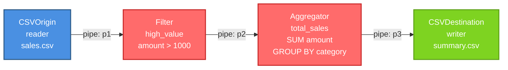
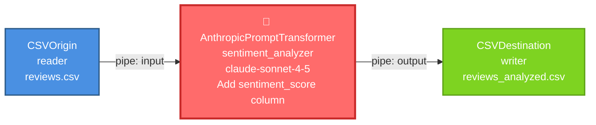
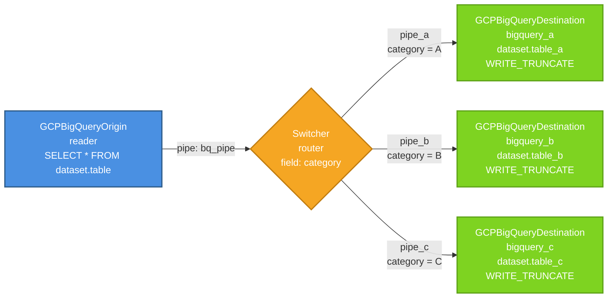
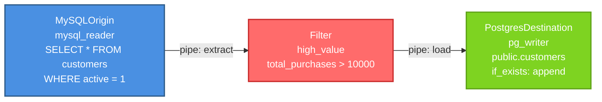
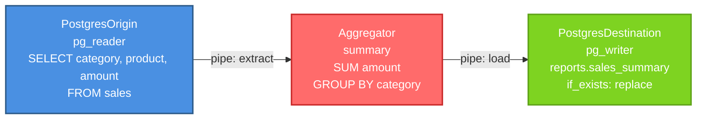
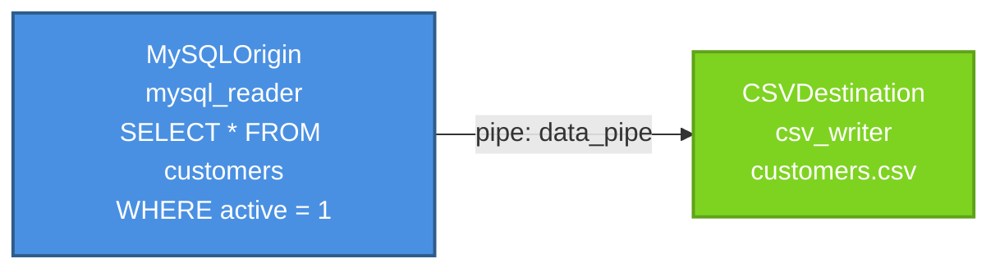
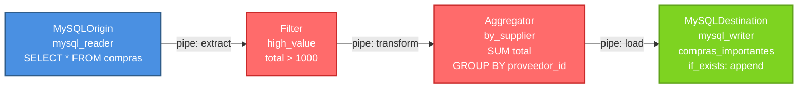

# Open-Stage

> A modern, AI-powered ETL framework for enterprise data workflows

[](https://opensource.org/licenses/MIT)
[](https://www.python.org/downloads/)
[]()

Open-Stage is an enterprise-grade ETL (Extract, Transform, Load) platform built in Python, inspired by IBM DataStage. It implements a pipes and filters architecture that enables the creation of modular, scalable data processing pipelines with multi-model generative AI capabilities.

## ✨ Key Features

- 🧩 **28 Modular Components** (5 base + 22 specialized)
- 🔌 **Multiple Data Sources**: CSV, MySQL, PostgreSQL, BigQuery, REST APIs
- 🤖 **AI-Powered Transformations**: Claude (Anthropic), Gemini (Google), DeepSeek
- ✅ **Robust Validations** and intelligent error handling
- ⛓️ **Method Chaining** for fluent syntax
- 🔧 **Extensible Architecture** by provider and component type
- 📜 **Open Source** under MIT License


## 🚀 Quick Start

### Installation

```bash
pip install -r requirements.txt
```

### Simple Pipeline Example

```python
from src.core.common import CSVOrigin, Filter, CSVDestination
from src.core.base import Pipe

# Create components
csv_origin = CSVOrigin("reader", filepath_or_buffer="data.csv")
filter_node = Filter("adults", "age", ">=", 18)
csv_dest = CSVDestination("writer", path_or_buf="output.csv", index=False)

# Create pipes
pipe1 = Pipe("pipe1")
pipe2 = Pipe("pipe2")

# Connect pipeline with method chaining
csv_origin.add_output_pipe(pipe1).set_destination(filter_node)
filter_node.add_output_pipe(pipe2).set_destination(csv_dest)

# Execute
csv_origin.pump()
```

## 📦 Project Structure

```
project/
├── LICENSE                    
├── README.md
├── requirements.txt
├── src/
│   ├── core/
│   │   ├── __init__.py
│   │   ├── base.py                    
│   │   │   ├── DataPackage           
│   │   │   ├── Pipe                  
│   │   │   ├── Origin                
│   │   │   ├── Destination           
│   │   │   └── Node                  
│   │   └── common.py                  
│   │       ├── CSVOrigin             
│   │       ├── APIRestOrigin         
│   │       ├── Printer               
│   │       ├── CSVDestination        
│   │       ├── Funnel                
│   │       ├── Switcher              
│   │       ├── Copy                  
│   │       ├── Filter                
│   │       ├── Generator                
│   │       ├── OpenOrigin                
│   │       ├── Aggregator            
│   │       ├── DeleteColumns         
│   │       ├── RemoveDuplicates      
│   │       ├── Joiner                
│   │       └── Transformer           
│   ├── postgres/
│   │   ├── __init__.py
│   │   └── common.py                  
│   │       ├── PostgresOrigin
│   │       └── PostgresDestination
│   ├── mysql/
│   │   ├── __init__.py
│   │   └── common.py
│   │       ├── MySQLOrigin
│   │       └── MySQLDestination
│   ├── google/
│   │   ├── __init__.py
│   │   ├── cloud.py                   
│   │   │   ├── GCPBigQueryOrigin     
│   │   │   └── GCPBigQueryDestination 
│   │   └── gemini.py                  
│   │       └── GeminiPromptTransformer 
│   ├── anthropic/
│   │   ├── __init__.py
│   │   └── claude.py                  
│   │       └── AnthropicPromptTransformer 
│   └── deepseek/
│       ├── __init__.py
│       └── deepseek.py                
│           └── DeepSeekPromptTransformer 
```

## 🏗️ Architecture

### Base Classes

Open-Stage is built on 5 fundamental classes:

1. **DataPackage**: Encapsulates data and metadata
2. **Pipe**: Connects components and transports data
3. **Origin** (0→1): Abstract class for data sources
4. **Destination** (1→0): Abstract class for data sinks
5. **Node**: Abstract class for transformers (inherits from Origin and Destination)

### Class Diagram


### Component Categories

#### 🔵 Origins (Data Sources) - 0→1

| Component | Description |
|-----------|-------------|
| `Generator` | Generates sequential numeric data |
| `CSVOrigin` | Reads CSV files |
| `APIRestOrigin` | Consumes REST APIs |
| `MySQLOrigin` | Queries MySQL databases |
| `PostgresOrigin` | Queries PostgreSQL databases |
| `GCPBigQueryOrigin` | Queries Google BigQuery |
| `OpenOrigin` | Takes any Dataframe |


#### 🟢 Destinations (Data Sinks) - 1→0

| Component | Description |
|-----------|-------------|
| `Printer` | Displays data to console |
| `CSVDestination` | Writes CSV files |
| `MySQLDestination` | Writes data to MySQL |
| `PostgresDestination` | Writes data to PostgreSQL |
| `GCPBigQueryDestination` | Loads data to BigQuery |

#### 🟡 Routers - N↔M

| Component | Connectivity | Description |
|-----------|--------------|-------------|
| `Funnel` | N→1 | Combines multiple streams |
| `Switcher` | 1→N | Routes data conditionally |
| `Copy` | 1→N | Duplicates data streams |

#### 🔴 Transformers - 1→1

| Component | Description |
|-----------|-------------|
| `Filter` | Filters rows (9 operators: <, >, <=, >=, !=, =, in, not in, between) |
| `Aggregator` | Aggregates data (sum, count, mean, etc.) |
| `DeleteColumns` | Removes specified columns |
| `RemoveDuplicates` | Deduplicates based on key field |
| `Joiner` | Joins two DataFrames (2→1) |
| `Transformer` | Applies custom functions |

#### 🤖 AI Transformers - 1→1

| Component | Provider | Model Examples |
|-----------|----------|----------------|
| `AnthropicPromptTransformer` | Anthropic | claude-sonnet-4-5-20250929 |
| `GeminiPromptTransformer` | Google | gemini-2.5-flash |
| `DeepSeekPromptTransformer` | DeepSeek | deepseek-chat, deepseek-coder |

## 💡 Usage Examples

### Example 1: Filter and Aggregate

```python
from src.core.common import CSVOrigin, Filter, Aggregator, CSVDestination
from src.core.base import Pipe

# Read CSV
csv_origin = CSVOrigin("reader", filepath_or_buffer="sales.csv")

# Filter high-value sales
filter_node = Filter("high_value", "amount", ">", 1000)

# Aggregate by category
aggregator = Aggregator("total_sales", "category", "total", "sum", "amount")

# Write results
csv_dest = CSVDestination("writer", path_or_buf="summary.csv", index=False)

# Connect pipeline
pipe1, pipe2, pipe3 = Pipe("p1"), Pipe("p2"), Pipe("p3")

csv_origin.add_output_pipe(pipe1).set_destination(filter_node)
filter_node.add_output_pipe(pipe2).set_destination(aggregator)
aggregator.add_output_pipe(pipe3).set_destination(csv_dest)

# Execute
csv_origin.pump()
```



### Example 2: AI-Powered Transformation

```python
from src.core.common import CSVOrigin, CSVDestination
from src.anthropic.claude import AnthropicPromptTransformer
from src.core.base import Pipe

# Read reviews
csv_origin = CSVOrigin("reader", filepath_or_buffer="reviews.csv")

# AI sentiment analysis with Claude
claude = AnthropicPromptTransformer(
    name="sentiment_analyzer",
    model="claude-sonnet-4-5-20250929",
    api_key="your-api-key",
    prompt="Add a sentiment_score column (positive, negative, neutral) based on the review text",
    max_tokens=16000
)

# Write enriched data
csv_dest = CSVDestination("writer", path_or_buf="reviews_analyzed.csv", index=False)

# Connect pipeline
pipe1, pipe2 = Pipe("input"), Pipe("output")

csv_origin.add_output_pipe(pipe1).set_destination(claude)
claude.add_output_pipe(pipe2).set_destination(csv_dest)

# Execute
csv_origin.pump()
```



### Example 3: Routing with Switcher and BigQuery

```python
from src.google.cloud import GCPBigQueryOrigin, GCPBigQueryDestination
from src.core.common import Switcher
from src.core.base import Pipe

# Read from BigQuery
bq_origin = GCPBigQueryOrigin(
    name="reader",
    project_id="my-project",
    query="SELECT * FROM dataset.table"
)

bq_pipe = Pipe(name='bq_pipe')

# Split by category
switcher = Switcher(
    "router",
    field="category",
    mapping={"A": "pipe_a", "B": "pipe_b", "C": "pipe_c"}
)

# Output pipes for A,B,C
pipe_a = Pipe(name='pipe_a')
pipe_b = Pipe(name='pipe_b')
pipe_c = Pipe(name='pipe_c')

bigquery_a = GCPBigQueryDestination(
    name="bigquery_a",
    project_id="my-project",
    dataset="dataset",
    table="table_a",
    write_disposition="WRITE_TRUNCATE"
)

bigquery_b = GCPBigQueryDestination(
    name="bigquery_b",
    project_id="my-project",
    dataset="dataset",
    table="table_b",
    write_disposition="WRITE_TRUNCATE"
)

bigquery_c = GCPBigQueryDestination(
    name="bigquery_c",
    project_id="my-project",
    dataset="dataset",
    table="table_c",
    write_disposition="WRITE_TRUNCATE"
)

bq_origin.add_output_pipe(bq_pipe).set_destination(switcher)
switcher.add_output_pipe(pipe_a).set_destination(bigquery_a)
switcher.add_output_pipe(pipe_b).set_destination(bigquery_b)
switcher.add_output_pipe(pipe_c).set_destination(bigquery_c)

bq_origin.pump()
```



### Example 4: MySQL to PostgreSQL Migration

```python
from src.mysql.common import MySQLOrigin
from src.postgres.common import PostgresDestination
from src.core.common import Filter
from src.core.base import Pipe

# Read from MySQL
mysql_origin = MySQLOrigin(
    name="mysql_reader",
    host="localhost",
    database="source_db",
    user="mysql_user",
    password="mysql_pass",
    query="SELECT * FROM customers WHERE active = 1"
)

# Filter high-value customers
filter_node = Filter("high_value", "total_purchases", ">", 10000)

# Write to PostgreSQL
pg_dest = PostgresDestination(
    name="pg_writer",
    host="localhost",
    database="target_db",
    user="postgres",
    password="postgres_pass",
    table="customers",
    schema="public",
    if_exists="append"
)

# Connect pipeline
pipe1 = Pipe("extract")
pipe2 = Pipe("load")

mysql_origin.add_output_pipe(pipe1).set_destination(filter_node)
filter_node.add_output_pipe(pipe2).set_destination(pg_dest)

# Execute
mysql_origin.pump()
```



### Example 5: PostgreSQL ETL Pipeline

```python
from src.postgres.common import PostgresOrigin, PostgresDestination
from src.core.common import Aggregator
from src.core.base import Pipe

# Read from PostgreSQL
pg_origin = PostgresOrigin(
    name="pg_reader",
    host="localhost",
    database="analytics_db",
    user="postgres",
    password="password",
    query="""
        SELECT category, product, amount, date 
        FROM sales 
        WHERE date >= '2024-01-01'
    """
)

# Aggregate by category
aggregator = Aggregator(
    name="summary",
    key="category",
    agg_field_name="total_sales",
    agg_type="sum",
    field_to_agg="amount"
)

# Write to PostgreSQL (different schema)
pg_dest = PostgresDestination(
    name="pg_writer",
    host="localhost",
    database="analytics_db",
    user="postgres",
    password="password",
    table="sales_summary",
    schema="reports",
    if_exists="replace"
)

# Connect pipeline
pipe1 = Pipe("extract")
pipe2 = Pipe("load")

pg_origin.add_output_pipe(pipe1).set_destination(aggregator)
aggregator.add_output_pipe(pipe2).set_destination(pg_dest)

# Execute
pg_origin.pump()
```



### Example 6: MySQL Query and Export to CSV

```python
from src.mysql.common import MySQLOrigin
from src.core.common import CSVDestination
from src.core.base import Pipe

# Read from MySQL
mysql_origin = MySQLOrigin(
    name="mysql_reader",
    host="localhost",
    database="company_db",
    user="root",
    password="password",
    query="SELECT * FROM customers WHERE active = 1"
)

# Write to CSV
csv_dest = CSVDestination(
    name="csv_writer",
    path_or_buf="customers.csv",
    index=False
)

# Connect pipeline
pipe = Pipe("data_pipe")

mysql_origin.add_output_pipe(pipe).set_destination(csv_dest)

# Execute
mysql_origin.pump()
```



### Example 7: MySQL ETL with Filter and Aggregation

```python
from src.mysql.common import MySQLOrigin, MySQLDestination
from src.core.common import Filter, Aggregator
from src.core.base import Pipe

# Read from MySQL
mysql_origin = MySQLOrigin(
    name="mysql_reader",
    host="localhost",
    database="dulceria",
    user="root",
    password="password",
    query="SELECT * FROM compras WHERE estado = 'pendiente'"
)

# Filter high-value purchases
filter_node = Filter("high_value", "total", ">", 1000)

# Aggregate by supplier
aggregator = Aggregator(
    name="by_supplier",
    key="proveedor_id",
    agg_field_name="total_compras",
    agg_type="sum",
    field_to_agg="total"
)

# Write to MySQL (different table)
mysql_dest = MySQLDestination(
    name="mysql_writer",
    host="localhost",
    database="dulceria",
    user="root",
    password="password",
    table="compras_importantes",
    if_exists="append"
)

# Connect pipeline
pipe1 = Pipe("extract")
pipe2 = Pipe("transform")
pipe3 = Pipe("load")

mysql_origin.add_output_pipe(pipe1).set_destination(filter_node)
filter_node.add_output_pipe(pipe2).set_destination(aggregator)
aggregator.add_output_pipe(pipe3).set_destination(mysql_dest)

# Execute
mysql_origin.pump()
```



## 🔧 Configuration

### Dependencies

```txt
pandas>=1.3.0
requests>=2.25.0
sqlalchemy>=1.4.0
psycopg2-binary>=2.9.0
pymysql>=1.0.0
google-cloud-bigquery>=3.0.0
google-auth>=2.0.0
db-dtypes>=1.0.0
anthropic>=0.18.0
google-generativeai>=0.3.0
openai>=1.0.0
```

## 🎯 Design Principles

1. **Pipes and Filters Architecture**: Modular, reusable components with clear separation of concerns
2. **Robust Validations**: Validation at construction time, data type validation, connectivity validation
3. **Error Handling**: Try-catch in critical operations, detailed error logging, graceful recovery
4. **Default Connectivity**: Origin (0→1), Destination (1→0), Node (flexible via override)
5. **Method Chaining**: Fluent syntax for pipeline construction
6. **Lazy Initialization**: External clients initialized on demand
7. **Immediate Processing**: `sink()` automatically calls `pump()`
8. **Resource Cleanup**: DataFrames cleaned post-processing, connections closed appropriately

## 📊 Connectivity Rules

| Component Type | Inputs | Outputs | Override |
|----------------|--------|---------|----------|
| **Origins** | 0 | 1 | No |
| **Destinations** | 1 | 0 | No |
| **Routers** (Funnel) | N | 1 | Yes (inputs) |
| **Routers** (Switcher, Copy) | 1 | N | Yes (outputs) |
| **Transformers** | 1 | 1 | No |
| **Transformers** (Joiner) | 2 | 1 | Yes (inputs) |
| **AI Transformers** | 1 | 1 | No |

## 🤝 Contributing

Contributions are welcome! To contribute:

1. Fork the repository
2. Create a feature branch (`git checkout -b feature/AmazingFeature`)
3. Commit your changes (`git commit -m 'Add some AmazingFeature'`)
4. Push to the branch (`git push origin feature/AmazingFeature`)
5. Open a Pull Request

### Contribution Guidelines

- Follow existing code style (2-space indentation)
- Add tests for new functionality
- Update documentation
- Follow the framework's design principles

## 🗺️ Roadmap

### Pending AI Providers
- [ ] OpenAI Transformer (GPT-4, GPT-4 Turbo, GPT-4o)
- [ ] Mistral AI Transformer
- [ ] Cohere Transformer
- [ ] Llama Transformer (via Ollama/local)

### Potential Components

#### Origins
- ✅ MySQL (completed)
- [ ] MariaDB, MongoDB, Kafka Consumer
- [ ] S3 (AWS), Azure Blob Storage, Snowflake
- [ ] Excel, Parquet, JSON, XML, SFTP

#### Destinations
- ✅ MySQL (completed)
- ✅ PostgreSQL (completed)
- [ ] MariaDB, MongoDB, Kafka Producer
- [ ] S3 (AWS), Azure Blob Storage, Snowflake
- [ ] Excel, Parquet, JSON, XML, SFTP

#### Transformers
- Sort, Pivot, Unpivot, Window Functions
- Lookup, Merge, Split, Sample
- Normalize, Encode

#### Validators
- Schema Validator, Data Quality Validator
- Business Rules Validator

#### Utilities
- Logger, Profiler, Cache, Checkpoint

## 📄 License

This project is licensed under the MIT License.

```
MIT License

Copyright (c) 2025 Bernardo Colorado Dubois and Saul Hernandez Cordova

Permission is hereby granted, free of charge, to any person obtaining a copy
of this software and associated documentation files (the "Software"), to deal
in the Software without restriction, including without limitation the rights
to use, copy, modify, merge, publish, distribute, sublicense, and/or sell
copies of the Software, and to permit persons to whom the Software is
furnished to do so, subject to the following conditions:

The above copyright notice and this permission notice shall be included in all
copies or substantial portions of the Software.

THE SOFTWARE IS PROVIDED "AS IS", WITHOUT WARRANTY OF ANY KIND, EXPRESS OR
IMPLIED, INCLUDING BUT NOT LIMITED TO THE WARRANTIES OF MERCHANTABILITY,
FITNESS FOR A PARTICULAR PURPOSE AND NONINFRINGEMENT. IN NO EVENT SHALL THE
AUTHORS OR COPYRIGHT HOLDERS BE LIABLE FOR ANY CLAIM, DAMAGES OR OTHER
LIABILITY, WHETHER IN AN ACTION OF CONTRACT, TORT OR OTHERWISE, ARISING FROM,
OUT OF OR IN CONNECTION WITH THE SOFTWARE OR THE USE OR OTHER DEALINGS IN THE
SOFTWARE.
```

## 👥 Authors

- **Bernardo Colorado Dubois**
- **Saul Hernandez Cordova**

## 🙏 Acknowledgments

Inspired by IBM DataStage and Unix pipes and filters architecture. Thanks to the Python open-source community and the libraries that make this project possible.

---

**Open-Stage** - A modern, AI-powered ETL framework for enterprise data workflows.