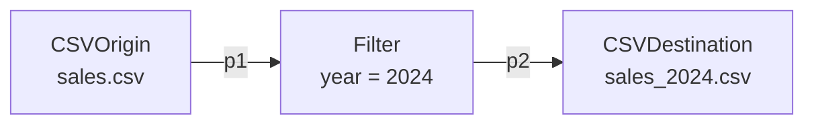
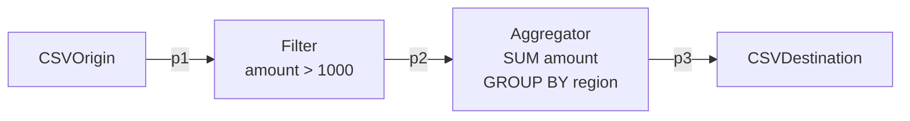
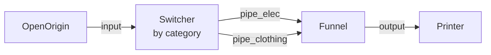

# Open-Stage

An ETL framework for Python inspired by IBM DataStage. Build data pipelines by connecting reusable components through pipes.

[](https://opensource.org/licenses/MIT)
[](https://www.python.org/downloads/)

---

## How it works

A pipeline in Open-Stage is a chain of components connected by `Pipe`s. Data flows left to right. There are three types of components:

- **Origin** — produces data (reads a CSV, queries a database, calls an API)
- **Node** — receives data, transforms it, and forwards it
- **Destination** — receives data and writes it (file, database, console)

```
Origin ──pipe──> Node ──pipe──> Node ──pipe──> Destination
```

In code:

```python
origin.add_output_pipe(Pipe("p1")).set_destination(node)
node.add_output_pipe(Pipe("p2")).set_destination(destination)

origin.pump()  # fires the entire pipeline
```

Every component has clear connectivity rules. For example, `Filter` accepts exactly 1 input and 1 output. Attempting to connect two inputs raises a `ValueError` immediately.

---

## Installation

```bash
# All included
pip install -e ".[all]"

# Only what you need
pip install -e ".[postgres,anthropic]"
pip install -e ".[mysql,openai]"
```

| Extra | Dependencies |
|-------|-------------|
| `postgres` | sqlalchemy, psycopg2-binary |
| `mysql` | sqlalchemy, pymysql |
| `bigquery` | google-cloud-bigquery, db-dtypes, google-auth |
| `anthropic` | anthropic |
| `openai` | openai |
| `deepseek` | openai |
| `gemini` | google-genai, google-generativeai |
| `all` | all of the above |

---

## Your first pipeline

Read a CSV, filter rows, and write the result to another CSV.

```python
from open_stage.core.base import Pipe
from open_stage.core.common import CSVOrigin, Filter, CSVDestination

# 1. Define components
origin      = CSVOrigin("sales", filepath_or_buffer="sales.csv")
filter_node = Filter("only_2024", field="year", condition="=", value_or_values=2024)
dest        = CSVDestination("result", path_or_buf="sales_2024.csv", index=False)

# 2. Connect with pipes
origin.add_output_pipe(Pipe("p1")).set_destination(filter_node)
filter_node.add_output_pipe(Pipe("p2")).set_destination(dest)

# 3. Run
origin.pump()
```


```mermaid
graph LR
    A[CSVOrigin<br/>sales.csv] -->|p1| B[Filter<br/>year = 2024]
    B -->|p2| C[CSVDestination<br/>sales_2024.csv]
```

---

## Available components

### Origins — produce data

| Component | Description | Import |
|-----------|-------------|--------|
| [`CSVOrigin`](docs/CSVOrigin.md) | Reads a CSV (`pandas.read_csv`) | `open_stage.core.common` |
| [`OpenOrigin`](docs/OpenOrigin.md) | Wraps an existing DataFrame | `open_stage.core.common` |
| [`APIRestOrigin`](docs/APIRestOrigin.md) | Consumes a REST endpoint | `open_stage.core.common` |
| [`PostgresOrigin`](docs/PostgresOrigin.md) | Queries PostgreSQL | `open_stage.postgres.common` |
| [`MySQLOrigin`](docs/MySQLOrigin.md) | Queries MySQL | `open_stage.mysql.common` |
| [`GCPBigQueryOrigin`](docs/GCPBigQueryOrigin.md) | Queries BigQuery | `open_stage.google.bigquery` |

### Destinations — write data

| Component | Description | Import |
|-----------|-------------|--------|
| [`Printer`](docs/Printer.md) | Prints the DataFrame to the console | `open_stage.core.common` |
| [`CSVDestination`](docs/CSVDestination.md) | Writes a CSV (`pandas.to_csv`) | `open_stage.core.common` |
| [`PostgresDestination`](docs/PostgresDestination.md) | Loads data into PostgreSQL | `open_stage.postgres.common` |
| [`MySQLDestination`](docs/MySQLDestination.md) | Loads data into MySQL | `open_stage.mysql.common` |
| [`GCPBigQueryDestination`](docs/GCPBigQueryDestination.md) | Loads data into BigQuery | `open_stage.google.bigquery` |

### Transformers — 1 input, 1 output

| Component | Description |
|-----------|-------------|
| [`Filter`](docs/Filter.md) | Filters rows by condition (`<`, `>`, `<=`, `>=`, `!=`, `=`, `in`, `not in`, `between`) |
| [`Aggregator`](docs/Aggregator.md) | Groups by key and aggregates (`sum`, `count`, `mean`, `min`, `max`, …) |
| [`DeleteColumns`](docs/DeleteColumns.md) | Removes columns |
| [`RemoveDuplicates`](docs/RemoveDuplicates.md) | Deduplication by key, with sort and retention criterion |
| [`Joiner`](docs/Joiner.md) | Joins two DataFrames by key (`inner`, `left`, `right`) |
| [`Transformer`](docs/Transformer.md) | Applies a custom Python function |

### Routers — distribute the flow

| Component | Connectivity | Description |
|-----------|--------------|-------------|
| [`Funnel`](docs/Funnel.md) | N → 1 | Concatenates multiple streams into one |
| [`Copy`](docs/Copy.md) | 1 → N | Duplicates data to multiple outputs |
| [`Switcher`](docs/Switcher.md) | 1 → N | Routes rows to different outputs based on a field value |

### AI Transformers — LLM transformation (1 input, 1 output)

Receive a DataFrame, send it as CSV to the model with a prompt, and parse the CSV response back to a DataFrame.

| Component | Provider | Import |
|-----------|----------|--------|
| [`AnthropicPromptTransformer`](docs/AnthropicPromptTransformer.md) | Anthropic (Claude) | `open_stage.anthropic.claude` |
| [`OpenAIPromptTransformer`](docs/OpenAIPromptTransformer.md) | OpenAI (GPT) | `open_stage.open_ai.transformer` |
| [`GeminiPromptTransformer`](docs/GeminiPromptTransformer.md) | Google (Gemini) | `open_stage.google.gemini` |
| [`DeepSeekPromptTransformer`](docs/DeepSeekPromptTransformer.md) | DeepSeek | `open_stage.deepseek.transformer` |

---

## Examples

### Filter and aggregate

```python
from open_stage.core.base import Pipe
from open_stage.core.common import CSVOrigin, Filter, Aggregator, CSVDestination

origin      = CSVOrigin("sales", filepath_or_buffer="sales.csv")
filter_node = Filter("high_value", field="amount", condition=">", value_or_values=1000)
aggregator  = Aggregator("by_region", key="region", agg_field_name="total",
                         agg_type="sum", field_to_agg="amount")
dest        = CSVDestination("summary", path_or_buf="summary.csv", index=False)

origin.add_output_pipe(Pipe("p1")).set_destination(filter_node)
filter_node.add_output_pipe(Pipe("p2")).set_destination(aggregator)
aggregator.add_output_pipe(Pipe("p3")).set_destination(dest)

origin.pump()
```


```mermaid
graph LR
    A[CSVOrigin] -->|p1| B[Filter<br/>amount > 1000]
    B -->|p2| C[Aggregator<br/>SUM amount<br/>GROUP BY region]
    C -->|p3| D[CSVDestination]
```

---

### Custom transformation

`Transformer` applies any function that receives a DataFrame and returns a DataFrame.

```python
from open_stage.core.base import Pipe
from open_stage.core.common import CSVOrigin, Transformer, CSVDestination

def apply_tax(df, rate, shipping):
    df = df.copy()
    df["final_price"] = df["price"] * (1 + rate) + shipping
    return df

origin      = CSVOrigin("products", filepath_or_buffer="products.csv")
transformer = Transformer(
    name="price_with_tax",
    transformer_function=apply_tax,
    transformer_kwargs={"rate": 0.16, "shipping": 50},
)
dest = CSVDestination("result", path_or_buf="products_with_price.csv", index=False)

origin.add_output_pipe(Pipe("p1")).set_destination(transformer)
transformer.add_output_pipe(Pipe("p2")).set_destination(dest)

origin.pump()
```

---

### Split and merge flows (Switcher + Funnel)

```python
from open_stage.core.base import Pipe
from open_stage.core.common import OpenOrigin, Switcher, Funnel, Printer
import pandas as pd

df = pd.DataFrame({
    "product":  ["A", "B", "C", "D"],
    "category": ["electronic", "clothing", "electronic", "clothing"],
})

origin   = OpenOrigin("data", df)
switcher = Switcher("by_category", field="category",
                    mapping={"electronic": "pipe_elec", "clothing": "pipe_clothing"})
funnel   = Funnel("merge")
printer  = Printer("output")

# Connect origin → switcher
origin.add_output_pipe(Pipe("input")).set_destination(switcher)

# Switcher → funnel (two branches)
switcher.add_output_pipe(Pipe("pipe_elec")).set_destination(funnel)
switcher.add_output_pipe(Pipe("pipe_clothing")).set_destination(funnel)

# Funnel → printer
funnel.add_output_pipe(Pipe("output")).set_destination(printer)

origin.pump()
```


```mermaid
graph LR
    A[OpenOrigin] -->|input| B[Switcher<br/>by category]
    B -->|pipe_elec| C[Funnel]
    B -->|pipe_clothing| C
    C -->|output| D[Printer]
```

---

### Database migration

```python
from open_stage.core.base import Pipe
from open_stage.mysql.common import MySQLOrigin
from open_stage.postgres.common import PostgresDestination

origin = MySQLOrigin(
    name="source",
    host="localhost", database="origin", user="root", password="...",
    query="SELECT * FROM customers WHERE active = 1",
)
dest = PostgresDestination(
    name="destination",
    host="localhost", database="target", user="postgres", password="...",
    table="customers", schema="public", if_exists="append",
)

origin.add_output_pipe(Pipe("migrate")).set_destination(dest)
origin.pump()
```

---

### AI transformation

```python
from open_stage.core.base import Pipe
from open_stage.core.common import CSVOrigin, CSVDestination
from open_stage.anthropic.claude import AnthropicPromptTransformer

origin = CSVOrigin("reviews", filepath_or_buffer="reviews.csv")

ai = AnthropicPromptTransformer(
    name="sentiment",
    model="claude-sonnet-4-5-20250929",
    api_key="sk-ant-...",
    prompt="Add a 'sentiment' column with the values: positive, neutral, or negative, "
           "based on the text in the 'review' column.",
)

dest = CSVDestination("result", path_or_buf="classified_reviews.csv", index=False)

origin.add_output_pipe(Pipe("p1")).set_destination(ai)
ai.add_output_pipe(Pipe("p2")).set_destination(dest)

origin.pump()
```

AI Transformer internal flow:
1. Receives the DataFrame
2. Serializes it to CSV
3. Sends it to the LLM along with the prompt
4. Parses the CSV response back to a DataFrame
5. Forwards it to the next component

---

## Advanced database options

`PostgresOrigin`, `MySQLOrigin`, and `GCPBigQueryOrigin` support:

| Parameter | Type | Description |
|-----------|------|-------------|
| `query` | `str` | SQL to execute |
| `table` | `str` | Reads a full table without writing `SELECT *` |
| `before_query` | `str` | SQL executed **before** the main query (temp tables, auditing) |
| `after_query` | `str` | SQL executed **after** the query (cleanup, logs) |
| `query_parameters` | `dict` | Named parameters using `:name` syntax (safe against SQL injection) |
| `max_results` | `int` | Limits returned rows (useful in testing) |
| `timeout` | `float` | Maximum execution time in seconds |

Example:

```python
from open_stage.postgres.common import PostgresOrigin

origin = PostgresOrigin(
    name="extraction",
    host="localhost", database="dw", user="postgres", password="...",
    before_query="CREATE TEMP TABLE staging AS SELECT * FROM raw WHERE valid = true",
    query="SELECT * FROM staging WHERE amount > :minimum",
    query_parameters={"minimum": 500.0},
    max_results=10000,
    timeout=120,
    after_query="INSERT INTO audit.log (table_name, date) VALUES ('staging', NOW())",
)
```

---

## Logging

All modules use `logging.getLogger(__name__)`. Configure the level from your script:

```python
import logging

logging.basicConfig(
    level=logging.INFO,
    format="%(asctime)s %(levelname)-8s %(name)s — %(message)s",
    datefmt="%H:%M:%S",
)
```

### Available levels

**`WARNING`** — errors only. For production.
```
10:15:03 WARNING  open_stage.core.common — CSVOrigin 'sales' has no output pipe configured
```

**`INFO`** — key pipeline events. Most common in development.
```
10:15:03 INFO     open_stage.core.common — CSVOrigin 'sales' read CSV with shape (3547, 11)
10:15:03 INFO     open_stage.core.common — Filter 'high_value' passed 891/3547 rows (amount > 1000)
10:15:03 INFO     open_stage.core.common — Aggregator 'by_region' completed: 891 rows → 5 groups
10:15:03 INFO     open_stage.core.common — CSVDestination 'result' wrote CSV with 5 rows
```

**`DEBUG`** — full internal detail for every component.
```
10:15:03 INFO     open_stage.core.common — CSVOrigin 'sales' read CSV with shape (3547, 11)
10:15:03 DEBUG    open_stage.core.common — CSVOrigin 'sales' pumped data through pipe 'p1'
10:15:03 DEBUG    open_stage.core.common — Filter 'high_value' received data from pipe 'p1'
10:15:03 INFO     open_stage.core.common — Filter 'high_value' passed 891/3547 rows (amount > 1000)
10:15:03 DEBUG    open_stage.core.common — Filter 'high_value' pumped data through pipe 'p2'
```

### Per-module control

You can silence noisy components without losing detail in others:

```python
logging.basicConfig(level=logging.DEBUG)

# BigQuery very verbose — warnings only
logging.getLogger("open_stage.google.bigquery").setLevel(logging.WARNING)

# Core at full detail
logging.getLogger("open_stage.core").setLevel(logging.DEBUG)
```

---

## Environment variables

Create a `.env` file in the project root:

```dotenv
# PostgreSQL
POSTGRES_HOST=localhost
POSTGRES_PORT=5432
POSTGRES_DB=my_db
POSTGRES_USER=postgres
POSTGRES_PASSWORD=secret

# MySQL
MYSQL_HOST=localhost
MYSQL_PORT=3306
MYSQL_DB=my_db
MYSQL_USER=root
MYSQL_PASSWORD=secret

# Google (BigQuery and Gemini)
GCP_PROJECT=my-project
GOOGLE_APPLICATION_CREDENTIALS=/path/to/service-account.json

# AI providers
ANTHROPIC_API_KEY=sk-ant-...
OPENAI_API_KEY=sk-...
DEEPSEEK_API_KEY=...
```

---

## Tests

```bash
pip install pytest
pytest tests/ -v
```

The test suite covers all core components without depending on external services.

---

## Project structure

```
open_stage/
├── core/
│   ├── base.py         # DataPackage, Pipe, Origin, Destination, Node, Mixins
│   ├── base_ai.py      # BasePromptTransformer — abstract base for all AI Transformers
│   └── common.py       # Core components (Filter, Aggregator, Joiner, Transformer, …)
├── postgres/
│   └── common.py       # PostgresOrigin, PostgresDestination
├── mysql/
│   └── common.py       # MySQLOrigin, MySQLDestination
├── google/
│   ├── bigquery.py     # GCPBigQueryOrigin, GCPBigQueryDestination
│   └── gemini.py       # GeminiPromptTransformer
├── anthropic/
│   └── claude.py       # AnthropicPromptTransformer
├── open_ai/
│   └── transformer.py  # OpenAIPromptTransformer
└── deepseek/
    └── transformer.py  # DeepSeekPromptTransformer

tests/
├── conftest.py
├── test_base.py
└── test_common.py
```

---

## License

MIT — Copyright (c) 2025 Bernardo Colorado Dubois
