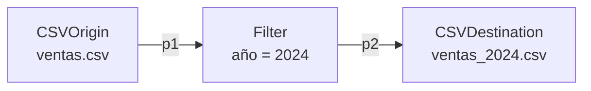
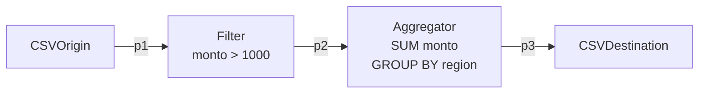
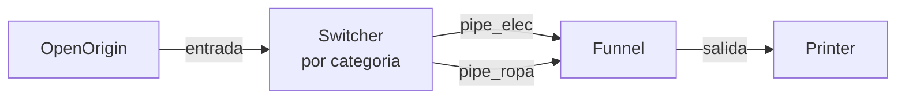

# Open-Stage

Un framework ETL para Python inspirado en IBM DataStage. Permite construir pipelines de datos conectando componentes reutilizables mediante tuberías (pipes).

[](https://opensource.org/licenses/MIT)
[](https://www.python.org/downloads/)

---

## Cómo funciona

Un pipeline en Open-Stage es una cadena de componentes conectados por `Pipe`s. Los datos fluyen de izquierda a derecha. Hay tres tipos de componentes:

- **Origin** — produce datos (lee un CSV, consulta una base de datos, llama una API)
- **Node** — recibe datos, los transforma, y los reenvía
- **Destination** — recibe datos y los escribe (archivo, base de datos, consola)

```
Origin ──pipe──> Node ──pipe──> Node ──pipe──> Destination
```

En código:

```python
origin.add_output_pipe(Pipe("p1")).set_destination(node)
node.add_output_pipe(Pipe("p2")).set_destination(destination)

origin.pump()  # dispara todo el pipeline
```

Cada componente tiene reglas de conectividad claras. Por ejemplo, `Filter` acepta exactamente 1 entrada y 1 salida. Si intentas conectar dos entradas, lanza un `ValueError` de inmediato.

---

## Instalación

```bash
# Todo incluido
pip install -e ".[all]"

# Solo lo que necesitas
pip install -e ".[postgres,anthropic]"
pip install -e ".[mysql,openai]"
```

| Extra | Dependencias |
|-------|-------------|
| `postgres` | sqlalchemy, psycopg2-binary |
| `mysql` | sqlalchemy, pymysql |
| `bigquery` | google-cloud-bigquery, db-dtypes, google-auth |
| `anthropic` | anthropic |
| `openai` | openai |
| `deepseek` | openai |
| `gemini` | google-genai, google-generativeai |
| `all` | todo lo anterior |

---

## Tu primer pipeline

Lee un CSV, filtra filas y escribe el resultado en otro CSV.

```python
from open_stage.core.base import Pipe
from open_stage.core.common import CSVOrigin, Filter, CSVDestination

# 1. Definir componentes
origin = CSVOrigin("ventas", filepath_or_buffer="ventas.csv")
filtro = Filter("solo_2024", field="año", condition="=", value_or_values=2024)
destino = CSVDestination("resultado", path_or_buf="ventas_2024.csv", index=False)

# 2. Conectar con pipes
origin.add_output_pipe(Pipe("p1")).set_destination(filtro)
filtro.add_output_pipe(Pipe("p2")).set_destination(destino)

# 3. Ejecutar
origin.pump()
```


```mermaid
graph LR
    A[CSVOrigin<br/>ventas.csv] -->|p1| B[Filter<br/>año = 2024]
    B -->|p2| C[CSVDestination<br/>ventas_2024.csv]
```

---

## Componentes disponibles

### Origins — producen datos

| Componente | Qué hace | Import |
|------------|----------|--------|
| `CSVOrigin` | Lee un CSV (`pandas.read_csv`) | `open_stage.core.common` |
| `OpenOrigin` | Envuelve un DataFrame existente | `open_stage.core.common` |
| `APIRestOrigin` | Consume un endpoint REST | `open_stage.core.common` |
| `PostgresOrigin` | Consulta PostgreSQL | `open_stage.postgres.common` |
| `MySQLOrigin` | Consulta MySQL | `open_stage.mysql.common` |
| `GCPBigQueryOrigin` | Consulta BigQuery | `open_stage.google.bigquery` |

### Destinations — escriben datos

| Componente | Qué hace | Import |
|------------|----------|--------|
| `Printer` | Imprime el DataFrame en consola | `open_stage.core.common` |
| `CSVDestination` | Escribe un CSV (`pandas.to_csv`) | `open_stage.core.common` |
| `PostgresDestination` | Carga datos en PostgreSQL | `open_stage.postgres.common` |
| `MySQLDestination` | Carga datos en MySQL | `open_stage.mysql.common` |
| `GCPBigQueryDestination` | Carga datos en BigQuery | `open_stage.google.bigquery` |

### Transformers — 1 entrada, 1 salida

| Componente | Qué hace |
|------------|----------|
| `Filter` | Filtra filas por condición (`<`, `>`, `<=`, `>=`, `!=`, `=`, `in`, `not in`, `between`) |
| `Aggregator` | Agrupa por clave y agrega (`sum`, `count`, `mean`, `min`, `max`, …) |
| `DeleteColumns` | Elimina columnas |
| `RemoveDuplicates` | Desduplicación por clave, con sort y criterio de retención |
| `Joiner` | Une dos DataFrames por clave (`inner`, `left`, `right`) |
| `Transformer` | Aplica una función Python personalizada |

### Routers — distribuyen el flujo

| Componente | Conectividad | Qué hace |
|------------|--------------|----------|
| `Funnel` | N → 1 | Concatena múltiples streams en uno |
| `Copy` | 1 → N | Duplica los datos hacia múltiples salidas |
| `Switcher` | 1 → N | Enruta filas a distintas salidas según el valor de un campo |

### AI Transformers — transformación con LLM (1 entrada, 1 salida)

Reciben un DataFrame, lo envían como CSV al modelo con un prompt, y parsean la respuesta CSV de vuelta a DataFrame.

| Componente | Proveedor | Import |
|------------|-----------|--------|
| `AnthropicPromptTransformer` | Anthropic (Claude) | `open_stage.anthropic.claude` |
| `OpenAIPromptTransformer` | OpenAI (GPT) | `open_stage.open_ai.transformer` |
| `GeminiPromptTransformer` | Google (Gemini) | `open_stage.google.gemini` |
| `DeepSeekPromptTransformer` | DeepSeek | `open_stage.deepseek.transformer` |

---

## Ejemplos

### Filtrar y agregar

```python
from open_stage.core.base import Pipe
from open_stage.core.common import CSVOrigin, Filter, Aggregator, CSVDestination

origin = CSVOrigin("ventas", filepath_or_buffer="ventas.csv")
filtro  = Filter("alto_valor", field="monto", condition=">", value_or_values=1000)
agrega  = Aggregator("por_region", key="region", agg_field_name="total",
                     agg_type="sum", field_to_agg="monto")
destino = CSVDestination("resumen", path_or_buf="resumen.csv", index=False)

origin.add_output_pipe(Pipe("p1")).set_destination(filtro)
filtro.add_output_pipe(Pipe("p2")).set_destination(agrega)
agrega.add_output_pipe(Pipe("p3")).set_destination(destino)

origin.pump()
```


```mermaid
graph LR
    A[CSVOrigin] -->|p1| B[Filter<br/>monto > 1000]
    B -->|p2| C[Aggregator<br/>SUM monto<br/>GROUP BY region]
    C -->|p3| D[CSVDestination]
```

---

### Transformación personalizada

`Transformer` aplica cualquier función que reciba un DataFrame y devuelva un DataFrame.

```python
from open_stage.core.base import Pipe
from open_stage.core.common import CSVOrigin, Transformer, CSVDestination

def aplicar_impuesto(df, tasa, envio):
    df = df.copy()
    df["precio_final"] = df["precio"] * (1 + tasa) + envio
    return df

origin      = CSVOrigin("productos", filepath_or_buffer="productos.csv")
transformer = Transformer(
    name="precio_con_impuesto",
    transformer_function=aplicar_impuesto,
    transformer_kwargs={"tasa": 0.16, "envio": 50},
)
destino = CSVDestination("resultado", path_or_buf="productos_con_precio.csv", index=False)

origin.add_output_pipe(Pipe("p1")).set_destination(transformer)
transformer.add_output_pipe(Pipe("p2")).set_destination(destino)

origin.pump()
```

---

### Separar y reunir flujos (Switcher + Funnel)

```python
from open_stage.core.base import Pipe
from open_stage.core.common import OpenOrigin, Switcher, Funnel, Printer
import pandas as pd

df = pd.DataFrame({
    "producto": ["A", "B", "C", "D"],
    "categoria": ["electronico", "ropa", "electronico", "ropa"],
})

origin   = OpenOrigin("datos", df)
switcher = Switcher("por_categoria", field="categoria",
                    mapping={"electronico": "pipe_elec", "ropa": "pipe_ropa"})
funnel   = Funnel("reunir")
printer  = Printer("salida")

# Conectar origin → switcher
origin.add_output_pipe(Pipe("entrada")).set_destination(switcher)

# Switcher → funnel (dos ramas)
switcher.add_output_pipe(Pipe("pipe_elec")).set_destination(funnel)
switcher.add_output_pipe(Pipe("pipe_ropa")).set_destination(funnel)

# Funnel → printer
funnel.add_output_pipe(Pipe("salida")).set_destination(printer)

origin.pump()
```


```mermaid
graph LR
    A[OpenOrigin] -->|entrada| B[Switcher<br/>por categoria]
    B -->|pipe_elec| C[Funnel]
    B -->|pipe_ropa| C
    C -->|salida| D[Printer]
```

---

### Migración entre bases de datos

```python
from open_stage.core.base import Pipe
from open_stage.mysql.common import MySQLOrigin
from open_stage.postgres.common import PostgresDestination

origin = MySQLOrigin(
    name="fuente",
    host="localhost", database="origen", user="root", password="...",
    query="SELECT * FROM clientes WHERE activo = 1",
)
destino = PostgresDestination(
    name="destino",
    host="localhost", database="destino", user="postgres", password="...",
    table="clientes", schema="public", if_exists="append",
)

origin.add_output_pipe(Pipe("migrar")).set_destination(destino)
origin.pump()
```

---

### Transformación con IA

```python
from open_stage.core.base import Pipe
from open_stage.core.common import CSVOrigin, CSVDestination
from open_stage.anthropic.claude import AnthropicPromptTransformer

origin = CSVOrigin("resenas", filepath_or_buffer="resenas.csv")

ai = AnthropicPromptTransformer(
    name="sentimiento",
    model="claude-sonnet-4-5-20250929",
    api_key="sk-ant-...",
    prompt="Agrega una columna 'sentimiento' con los valores: positivo, neutro o negativo, "
           "basándote en el texto de la columna 'resena'.",
)

destino = CSVDestination("resultado", path_or_buf="resenas_clasificadas.csv", index=False)

origin.add_output_pipe(Pipe("p1")).set_destination(ai)
ai.add_output_pipe(Pipe("p2")).set_destination(destino)

origin.pump()
```

El flujo interno del AI Transformer:
1. Recibe el DataFrame
2. Lo serializa a CSV
3. Lo envía al LLM junto con el prompt
4. Parsea la respuesta CSV de vuelta a DataFrame
5. Lo reenvía al siguiente componente

---

## Opciones avanzadas de bases de datos

`PostgresOrigin`, `MySQLOrigin` y `GCPBigQueryOrigin` soportan:

| Parámetro | Tipo | Descripción |
|-----------|------|-------------|
| `query` | `str` | SQL a ejecutar |
| `table` | `str` | Lee una tabla completa sin escribir `SELECT *` |
| `before_query` | `str` | SQL ejecutado **antes** de la consulta principal (temp tables, auditoría) |
| `after_query` | `str` | SQL ejecutado **después** de la consulta (limpieza, logs) |
| `query_parameters` | `dict` | Parámetros nombrados usando sintaxis `:nombre` (seguro contra SQL injection) |
| `max_results` | `int` | Limita las filas devueltas (útil en pruebas) |
| `timeout` | `float` | Tiempo máximo de ejecución en segundos |

Ejemplo:

```python
from open_stage.postgres.common import PostgresOrigin

origin = PostgresOrigin(
    name="extraccion",
    host="localhost", database="dw", user="postgres", password="...",
    before_query="CREATE TEMP TABLE staging AS SELECT * FROM raw WHERE valido = true",
    query="SELECT * FROM staging WHERE monto > :minimo",
    query_parameters={"minimo": 500.0},
    max_results=10000,
    timeout=120,
    after_query="INSERT INTO auditoria.log (tabla, fecha) VALUES ('staging', NOW())",
)
```

---

## Logging

Todos los módulos usan `logging.getLogger(__name__)`. Configura el nivel desde tu script:

```python
import logging

logging.basicConfig(
    level=logging.INFO,
    format="%(asctime)s %(levelname)-8s %(name)s — %(message)s",
    datefmt="%H:%M:%S",
)
```

### Niveles disponibles

**`WARNING`** — solo problemas. Para producción.
```
10:15:03 WARNING  open_stage.core.common — CSVOrigin 'ventas' has no output pipe configured
```

**`INFO`** — eventos clave del pipeline. El más común en desarrollo.
```
10:15:03 INFO     open_stage.core.common — CSVOrigin 'ventas' read CSV with shape (3547, 11)
10:15:03 INFO     open_stage.core.common — Filter 'alto_valor' passed 891/3547 rows (monto > 1000)
10:15:03 INFO     open_stage.core.common — Aggregator 'por_region' completed: 891 rows → 5 groups
10:15:03 INFO     open_stage.core.common — CSVDestination 'resultado' wrote CSV with 5 rows
```

**`DEBUG`** — todo el detalle interno de cada componente.
```
10:15:03 INFO     open_stage.core.common — CSVOrigin 'ventas' read CSV with shape (3547, 11)
10:15:03 DEBUG    open_stage.core.common — CSVOrigin 'ventas' pumped data through pipe 'p1'
10:15:03 DEBUG    open_stage.core.common — Filter 'alto_valor' received data from pipe 'p1'
10:15:03 INFO     open_stage.core.common — Filter 'alto_valor' passed 891/3547 rows (monto > 1000)
10:15:03 DEBUG    open_stage.core.common — Filter 'alto_valor' pumped data through pipe 'p2'
```

### Control por módulo

Puedes silenciar componentes ruidosos sin perder el detalle en otros:

```python
logging.basicConfig(level=logging.DEBUG)

# BigQuery muy verboso — solo advertencias
logging.getLogger("open_stage.google.bigquery").setLevel(logging.WARNING)

# Core en detalle completo
logging.getLogger("open_stage.core").setLevel(logging.DEBUG)
```

---

## Variables de entorno

Crea un archivo `.env` en la raíz del proyecto:

```dotenv
# PostgreSQL
POSTGRES_HOST=localhost
POSTGRES_PORT=5432
POSTGRES_DB=mi_base
POSTGRES_USER=postgres
POSTGRES_PASSWORD=secreto

# MySQL
MYSQL_HOST=localhost
MYSQL_PORT=3306
MYSQL_DB=mi_base
MYSQL_USER=root
MYSQL_PASSWORD=secreto

# Google (BigQuery y Gemini)
GCP_PROJECT=mi-proyecto
GOOGLE_APPLICATION_CREDENTIALS=/ruta/a/service-account.json

# Proveedores de IA
ANTHROPIC_API_KEY=sk-ant-...
OPENAI_API_KEY=sk-...
DEEPSEEK_API_KEY=...
```

---

## Tests

```bash
pip install pytest
pytest tests/ -v
```

El suite cubre todos los componentes core sin depender de servicios externos.

---

## Estructura del proyecto

```
open_stage/
├── core/
│   ├── base.py         # DataPackage, Pipe, Origin, Destination, Node, Mixins
│   ├── base_ai.py      # BasePromptTransformer — base abstracta para todos los AI Transformers
│   └── common.py       # Componentes principales (Filter, Aggregator, Joiner, Transformer, …)
├── postgres/
│   └── common.py       # PostgresOrigin, PostgresDestination
├── mysql/
│   └── common.py       # MySQLOrigin, MySQLDestination
├── google/
│   ├── bigquery.py     # GCPBigQueryOrigin, GCPBigQueryDestination
│   └── gemini.py       # GeminiPromptTransformer
├── anthropic/
│   └── claude.py       # AnthropicPromptTransformer
├── open_ai/
│   └── transformer.py  # OpenAIPromptTransformer
└── deepseek/
    └── transformer.py  # DeepSeekPromptTransformer

tests/
├── conftest.py
├── test_base.py
└── test_common.py
```

---

## Licencia

MIT — Copyright (c) 2025 Bernardo Colorado Dubois
