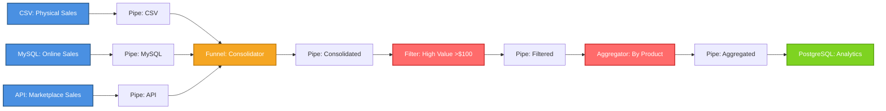
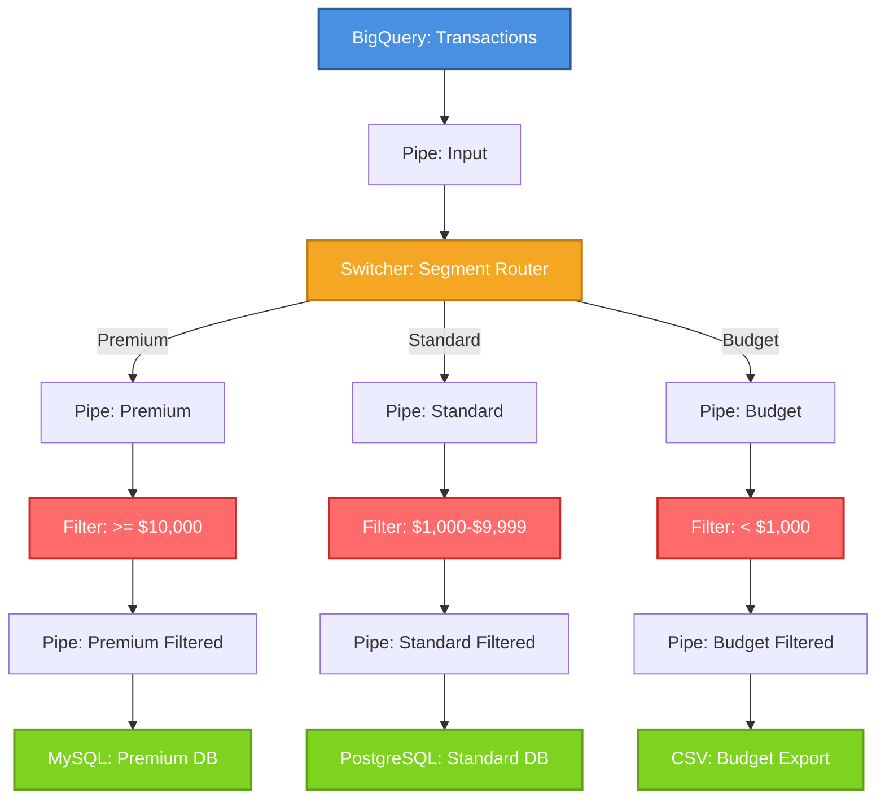
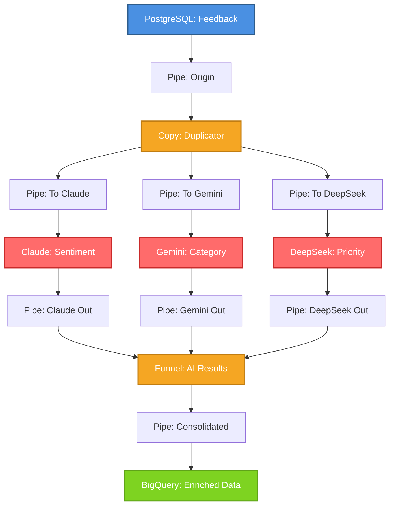
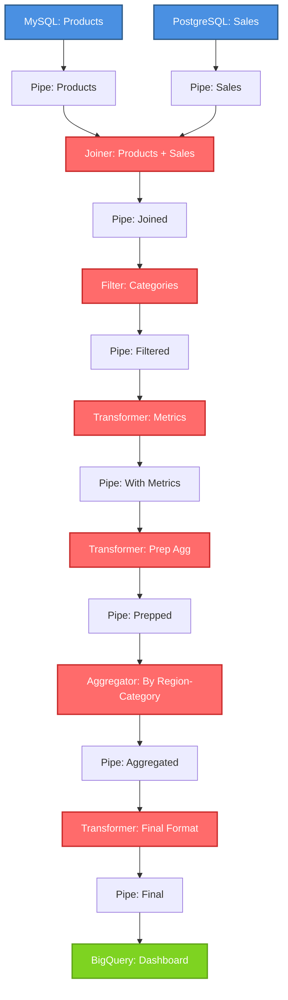
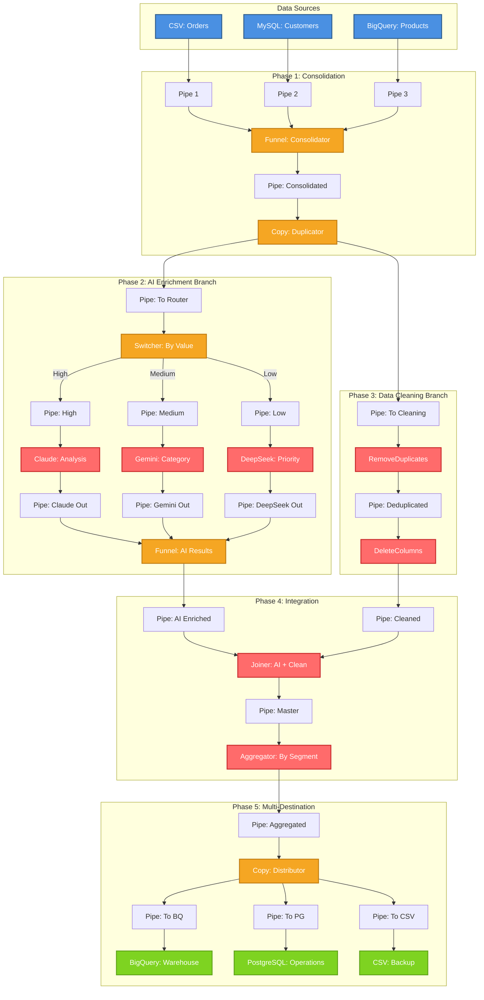

# Open-Stage Complex Pipeline Examples

This document contains 6 advanced pipeline examples demonstrating the full capabilities of Open-Stage ETL framework.

---

## Example 1: Multi-Source Data Integration

### Description
Combine sales data from 3 different sources (CSV, MySQL, REST API), apply transformations, and consolidate into PostgreSQL.

### Use Case
Consolidated sales dashboard combining physical store, online, and marketplace sales.

### Architecture Diagram



### Code

```python
"""
EXAMPLE 1: MULTI-SOURCE DATA INTEGRATION
==========================================
Scenario: Combine sales data from 3 different sources (CSV, MySQL, REST API),
          apply transformations and consolidate into PostgreSQL.

Architecture:
  CSV ─────────┐
               ├──> Funnel ──> Filter ──> Aggregator ──> PostgreSQL
  MySQL ───────┤
               │
  API REST ────┘

Use case: Consolidated sales dashboard
"""

import os
from src.core.common import CSVOrigin, Funnel, Filter, Aggregator, Pipe
from src.mysql.common import MySQLOrigin
from src.core.common import APIRestOrigin
from src.postgres.common import PostgresDestination
from dotenv import load_dotenv

load_dotenv()

# ====================
# 1. DEFINE ORIGINS
# ====================

# Origin 1: Physical store sales (CSV)
csv_sales = CSVOrigin(
    name="physical_store_sales",
    filepath_or_buffer="data/physical_sales_2024.csv",
    sep=",",
    encoding="utf-8"
)

# Origin 2: Online sales (MySQL)
mysql_sales = MySQLOrigin(
    name="online_sales",
    host="localhost",
    port=3306,
    database="ecommerce",
    user="root",
    password=os.getenv("MYSQL_PASSWORD"),
    query="""
        SELECT 
            order_id,
            product_id,
            quantity,
            unit_price,
            (quantity * unit_price) as total_amount,
            order_date,
            'online' as channel
        FROM orders
        WHERE order_date >= '2024-01-01'
    """
)

# Origin 3: Marketplace sales (REST API)
api_sales = APIRestOrigin(
    name="marketplace_sales",
    url="https://api.marketplace.com/v1/sales",
    method="GET",
    headers={
        "Authorization": f"Bearer {os.getenv('MARKETPLACE_API_KEY')}",
        "Content-Type": "application/json"
    },
    params={
        "start_date": "2024-01-01",
        "status": "completed"
    },
    path="data.sales",
    fields=["order_id", "product_id", "quantity", "unit_price", "total_amount", "order_date"]
)

# ====================
# 2. INPUT PIPES
# ====================
pipe_csv = Pipe("pipe_csv_sales")
pipe_mysql = Pipe("pipe_mysql_sales")
pipe_api = Pipe("pipe_api_sales")

# ====================
# 3. FUNNEL (COMBINE)
# ====================
sales_funnel = Funnel("sales_consolidator")

# Connect 3 origins to funnel
csv_sales.add_output_pipe(pipe_csv).set_destination(sales_funnel)
mysql_sales.add_output_pipe(pipe_mysql).set_destination(sales_funnel)
api_sales.add_output_pipe(pipe_api).set_destination(sales_funnel)

# ====================
# 4. TRANSFORMATIONS
# ====================
pipe_consolidated = Pipe("pipe_consolidated")

# Filter: Only sales > $100
sales_filter = Filter(
    name="high_value_filter",
    field="total_amount",
    condition=">",
    value_or_values=100
)

pipe_filtered = Pipe("pipe_filtered")

# Aggregation by product
sales_aggregator = Aggregator(
    name="product_aggregator",
    key="product_id",
    agg_field_name="total_revenue",
    agg_type="sum",
    field_to_agg="total_amount"
)

pipe_aggregated = Pipe("pipe_aggregated")

# ====================
# 5. FINAL DESTINATION
# ====================
postgres_destination = PostgresDestination(
    name="analytics_warehouse",
    host="localhost",
    port=5432,
    database="analytics",
    user="postgres",
    password=os.getenv("POSTGRES_PASSWORD"),
    table="product_sales_summary",
    schema="public",
    if_exists="replace"
)

# ====================
# 6. CONNECT PIPELINE
# ====================
sales_funnel.add_output_pipe(pipe_consolidated).set_destination(sales_filter)
sales_filter.add_output_pipe(pipe_filtered).set_destination(sales_aggregator)
sales_aggregator.add_output_pipe(pipe_aggregated).set_destination(postgres_destination)

# ====================
# 7. EXECUTE PIPELINE
# ====================
print("="*60)
print("STARTING MULTI-SOURCE INTEGRATION PIPELINE")
print("="*60)

csv_sales.pump()
mysql_sales.pump()
api_sales.pump()

print("="*60)
print("PIPELINE COMPLETED")
print("="*60)
```

---

## Example 2: Conditional Routing with Switcher

### Description
Process transactions and route them to different destinations based on type, applying specific transformations for each type.

### Use Case
Bank transaction processing system by category (premium, standard, budget).

### Architecture Diagram



### Code

```python
"""
EXAMPLE 2: CONDITIONAL ROUTING WITH SWITCHER
=============================================
Scenario: Process transactions and route them to different destinations 
          based on type, applying specific transformations for each type.

Architecture:
                    ┌──> Filter(high_value) ──> MySQL(premium)
                    │
  BigQuery ──> Switcher ──> Filter(medium_value) ──> PostgreSQL(standard)
                    │
                    └──> Filter(low_value) ──> CSV(budget)

Use case: Bank transaction processing system by category
"""

import os
from src.core.common import Switcher, Filter, CSVDestination, Pipe
from src.google.cloud import GCPBigQueryOrigin
from src.mysql.common import MySQLDestination
from src.postgres.common import PostgresDestination
from dotenv import load_dotenv

load_dotenv()

# ====================
# 1. ORIGIN: BigQuery
# ====================
transactions_origin = GCPBigQueryOrigin(
    name="transactions_source",
    project_id=os.getenv("GCP_PROJECT_ID"),
    query="""
        SELECT 
            transaction_id,
            customer_id,
            amount,
            transaction_type,
            transaction_date,
            status,
            CASE 
                WHEN amount >= 10000 THEN 'premium'
                WHEN amount >= 1000 THEN 'standard'
                ELSE 'budget'
            END as customer_segment
        FROM `banking.transactions`
        WHERE transaction_date >= DATE_SUB(CURRENT_DATE(), INTERVAL 30 DAY)
        AND status = 'completed'
    """,
    credentials_path=os.getenv("GCP_CREDENTIALS_FILE_PATH")
)

pipe_input = Pipe("pipe_transactions_input")

# ====================
# 2. SWITCHER (ROUTER)
# ====================
segment_router = Switcher(
    name="segment_router",
    field="customer_segment",
    mapping={
        "premium": "pipe_premium",
        "standard": "pipe_standard",
        "budget": "pipe_budget"
    },
    fail_on_unmatch=True
)

transactions_origin.add_output_pipe(pipe_input).set_destination(segment_router)

# ====================
# 3. PREMIUM ROUTE
# ====================
pipe_premium = Pipe("pipe_premium")
pipe_premium_filtered = Pipe("pipe_premium_filtered")

premium_filter = Filter(
    name="premium_filter",
    field="amount",
    condition=">=",
    value_or_values=10000
)

premium_destination = MySQLDestination(
    name="premium_db",
    host="localhost",
    port=3306,
    database="banking_premium",
    user="root",
    password=os.getenv("MYSQL_PASSWORD"),
    table="premium_transactions",
    if_exists="append"
)

segment_router.add_output_pipe(pipe_premium).set_destination(premium_filter)
premium_filter.add_output_pipe(pipe_premium_filtered).set_destination(premium_destination)

# ====================
# 4. STANDARD ROUTE
# ====================
pipe_standard = Pipe("pipe_standard")
pipe_standard_filtered = Pipe("pipe_standard_filtered")

standard_filter = Filter(
    name="standard_filter",
    field="amount",
    condition="between",
    value_or_values=[1000, 9999]
)

standard_destination = PostgresDestination(
    name="standard_db",
    host="localhost",
    port=5432,
    database="banking_standard",
    user="postgres",
    password=os.getenv("POSTGRES_PASSWORD"),
    table="standard_transactions",
    schema="public",
    if_exists="append"
)

segment_router.add_output_pipe(pipe_standard).set_destination(standard_filter)
standard_filter.add_output_pipe(pipe_standard_filtered).set_destination(standard_destination)

# ====================
# 5. BUDGET ROUTE
# ====================
pipe_budget = Pipe("pipe_budget")
pipe_budget_filtered = Pipe("pipe_budget_filtered")

budget_filter = Filter(
    name="budget_filter",
    field="amount",
    condition="<",
    value_or_values=1000
)

budget_destination = CSVDestination(
    name="budget_csv",
    path_or_buf="output/budget_transactions.csv",
    index=False,
    sep=","
)

segment_router.add_output_pipe(pipe_budget).set_destination(budget_filter)
budget_filter.add_output_pipe(pipe_budget_filtered).set_destination(budget_destination)

# ====================
# 6. EXECUTE PIPELINE
# ====================
print("="*60)
print("STARTING CONDITIONAL ROUTING PIPELINE")
print("="*60)

transactions_origin.pump()

print("="*60)
print("PIPELINE COMPLETED")
print("="*60)
```

---

## Example 3: AI-Powered Data Enrichment Pipeline

### Description
Process customer feedback, analyze with multiple AI models (Claude, Gemini, DeepSeek), and consolidate enriched results.

### Use Case
Customer feedback analysis and prioritization system using multiple AI models.

### Architecture Diagram



### Code

```python
"""
EXAMPLE 3: AI-POWERED DATA ENRICHMENT
======================================
Scenario: Process customer feedback, analyze with multiple AI models,
          and consolidate enriched results.

Architecture:
                          ┌──> Claude (sentiment) ───┐
                          │                           │
  PostgreSQL ──> Copy ────┼──> Gemini (category) ────┼──> Funnel ──> BigQuery
                          │                           │
                          └──> DeepSeek (priority) ──┘

Use case: Customer feedback analysis and prioritization system
"""

import os
from src.core.common import Copy, Funnel, Pipe
from src.postgres.common import PostgresOrigin
from src.anthropic.claude import AnthropicPromptTransformer
from src.google.gemini import GeminiPromptTransformer
from src.deepseek.deepseek import DeepSeekPromptTransformer
from src.google.cloud import GCPBigQueryDestination
from dotenv import load_dotenv

load_dotenv()

# ====================
# 1. ORIGIN: PostgreSQL with customer feedback
# ====================
feedback_origin = PostgresOrigin(
    name="customer_feedback",
    host="localhost",
    port=5432,
    database="customer_service",
    user="postgres",
    password=os.getenv("POSTGRES_PASSWORD"),
    query="""
        SELECT 
            feedback_id,
            customer_id,
            product_id,
            feedback_text,
            created_at,
            channel
        FROM customer_feedback
        WHERE created_at >= CURRENT_DATE - INTERVAL '7 days'
        AND processed = false
        ORDER BY created_at DESC
        LIMIT 100
    """
)

pipe_origin = Pipe("pipe_feedback_origin")

# ====================
# 2. COPY (DUPLICATE FOR 3 AIs)
# ====================
feedback_copy = Copy("feedback_duplicator")
feedback_origin.add_output_pipe(pipe_origin).set_destination(feedback_copy)

pipe_to_claude = Pipe("pipe_to_claude")
pipe_to_gemini = Pipe("pipe_to_gemini")
pipe_to_deepseek = Pipe("pipe_to_deepseek")

# ====================
# 3. AI TRANSFORMERS
# ====================

# Claude: Sentiment analysis
claude_sentiment = AnthropicPromptTransformer(
    name="sentiment_analyzer",
    model="claude-sonnet-4-5-20250929",
    api_key=os.getenv("ANTHROPIC_API_KEY"),
    prompt="""
    Analyze the sentiment of each feedback in the 'feedback_text' column.
    Add a new column called 'sentiment' with values: 'positive', 'negative', or 'neutral'.
    Add another column called 'sentiment_score' with a value from -1.0 (very negative) to 1.0 (very positive).
    Keep all original columns.
    """,
    max_tokens=16000
)

# Gemini: Categorization
gemini_category = GeminiPromptTransformer(
    name="category_classifier",
    model="gemini-2.0-flash-exp",
    api_key=os.getenv("GEMINI_API_KEY"),
    prompt="""
    Categorize each feedback into one of these categories:
    - product_quality
    - customer_service
    - shipping
    - pricing
    - website_ux
    - other
    
    Add a column called 'category' with the appropriate category.
    Keep all original columns.
    """,
    max_tokens=16000
)

# DeepSeek: Prioritization
deepseek_priority = DeepSeekPromptTransformer(
    name="priority_classifier",
    model="deepseek-chat",
    api_key=os.getenv("DEEPSEEK_API_KEY"),
    prompt="""
    Analyze the urgency of each feedback and assign a priority level.
    Add a column called 'priority' with values: 'high', 'medium', or 'low'.
    Add a column called 'requires_immediate_action' with boolean values (true/false).
    Keep all original columns.
    """,
    max_tokens=8192
)

feedback_copy.add_output_pipe(pipe_to_claude).set_destination(claude_sentiment)
feedback_copy.add_output_pipe(pipe_to_gemini).set_destination(gemini_category)
feedback_copy.add_output_pipe(pipe_to_deepseek).set_destination(deepseek_priority)

# ====================
# 4. AI OUTPUT PIPES
# ====================
pipe_claude_out = Pipe("pipe_claude_sentiment")
pipe_gemini_out = Pipe("pipe_gemini_category")
pipe_deepseek_out = Pipe("pipe_deepseek_priority")

# ====================
# 5. FUNNEL (COMBINE AI RESULTS)
# ====================
ai_results_funnel = Funnel("ai_results_consolidator")

claude_sentiment.add_output_pipe(pipe_claude_out).set_destination(ai_results_funnel)
gemini_category.add_output_pipe(pipe_gemini_out).set_destination(ai_results_funnel)
deepseek_priority.add_output_pipe(pipe_deepseek_out).set_destination(ai_results_funnel)

pipe_funnel_out = Pipe("pipe_ai_consolidated")

# ====================
# 6. FINAL DESTINATION: BigQuery
# ====================
enriched_destination = GCPBigQueryDestination(
    name="enriched_feedback_warehouse",
    project_id=os.getenv("GCP_PROJECT_ID"),
    dataset="customer_analytics",
    table="enriched_feedback",
    write_disposition="WRITE_APPEND",
    credentials_path=os.getenv("GCP_CREDENTIALS_FILE_PATH")
)

pipe_to_destination = Pipe("pipe_to_bigquery")
ai_results_funnel.add_output_pipe(pipe_to_destination).set_destination(enriched_destination)

# ====================
# 7. EXECUTE PIPELINE
# ====================
print("="*60)
print("STARTING AI-POWERED ENRICHMENT PIPELINE")
print("="*60)
print("Processing feedback with:")
print("  • Claude: Sentiment analysis")
print("  • Gemini: Categorization")
print("  • DeepSeek: Prioritization")
print("="*60)

feedback_origin.pump()

print("="*60)
print("PIPELINE COMPLETED")
print("="*60)
```

---

## Example 4: Data Quality & Deduplication Pipeline

### Description
Clean, deduplicate and standardize customer data from multiple sources.

### Use Case
Customer database consolidation and cleaning.

### Architecture Diagram


### Code

```python
"""
EXAMPLE 4: DATA QUALITY & DEDUPLICATION PIPELINE
=================================================
Scenario: Clean, deduplicate and standardize customer data from multiple sources.

Architecture:
  CSV ──> Filter(valid_emails) ──> RemoveDuplicates ──> DeleteColumns ──> Transformer ──> MySQL

Transformations:
  1. Filter valid emails
  2. Remove duplicates (keep most recent)
  3. Delete sensitive/unnecessary columns
  4. Standardize data format
  5. Save clean data

Use case: Customer database consolidation and cleaning
"""

import os
import pandas as pd
from src.core.common import CSVOrigin, Filter, RemoveDuplicates, DeleteColumns, Transformer, Pipe
from src.mysql.common import MySQLDestination
from dotenv import load_dotenv

load_dotenv()

# ====================
# 1. ORIGIN: CSV with customer data (possibly dirty)
# ====================
customers_origin = CSVOrigin(
    name="raw_customers",
    filepath_or_buffer="data/customers_raw.csv",
    sep=",",
    encoding="utf-8"
)

pipe_origin = Pipe("pipe_raw_data")

# ====================
# 2. FILTER: Only valid emails
# ====================
email_filter = Filter(
    name="valid_email_filter",
    field="email",
    condition="!=",
    value_or_values=""
)

pipe_filtered = Pipe("pipe_valid_emails")

# ====================
# 3. REMOVE DUPLICATES
# ====================
deduplicator = RemoveDuplicates(
    name="customer_deduplicator",
    key="email",
    sort_by="last_updated",
    orientation="DESC",
    retain="FIRST"
)

pipe_deduplicated = Pipe("pipe_unique_customers")

# ====================
# 4. DELETE SENSITIVE/UNNECESSARY COLUMNS
# ====================
column_cleaner = DeleteColumns(
    name="remove_sensitive_data",
    columns=["ssn", "credit_card", "password_hash", "internal_notes", "temp_column"]
)

pipe_clean_columns = Pipe("pipe_clean_columns")

# ====================
# 5. CUSTOM TRANSFORMER: Standardize data
# ====================
def standardize_customer_data(df: pd.DataFrame) -> pd.DataFrame:
    """Standardizes customer data format"""
    result = df.copy()
    
    # 1. Standardize names: Title Case
    if 'first_name' in result.columns:
        result['first_name'] = result['first_name'].str.strip().str.title()
    
    if 'last_name' in result.columns:
        result['last_name'] = result['last_name'].str.strip().str.title()
    
    # 2. Standardize emails: lowercase
    if 'email' in result.columns:
        result['email'] = result['email'].str.strip().str.lower()
    
    # 3. Standardize phones: remove special characters
    if 'phone' in result.columns:
        result['phone'] = result['phone'].str.replace(r'[^\d]', '', regex=True)
    
    # 4. Create full name field
    if 'first_name' in result.columns and 'last_name' in result.columns:
        result['full_name'] = result['first_name'] + ' ' + result['last_name']
    
    # 5. Standardize zip codes (5 digits)
    if 'zip_code' in result.columns:
        result['zip_code'] = result['zip_code'].astype(str).str.zfill(5)
    
    # 6. Convert dates to ISO format
    if 'created_at' in result.columns:
        result['created_at'] = pd.to_datetime(result['created_at']).dt.strftime('%Y-%m-%d')
    
    # 7. Add processing timestamp
    result['processed_at'] = pd.Timestamp.now().strftime('%Y-%m-%d %H:%M:%S')
    
    # 8. Add data quality score
    result['data_quality_score'] = 100
    
    if 'phone' in result.columns:
        result.loc[result['phone'].isna(), 'data_quality_score'] -= 10
    
    if 'address' in result.columns:
        result.loc[result['address'].isna(), 'data_quality_score'] -= 10
    
    print(f"Standardization complete:")
    print(f"  - Records processed: {len(result)}")
    print(f"  - Average data quality score: {result['data_quality_score'].mean():.2f}")
    
    return result

data_standardizer = Transformer(
    name="data_standardizer",
    transformer_function=standardize_customer_data
)

pipe_standardized = Pipe("pipe_standardized")

# ====================
# 6. DESTINATION: MySQL (clean data)
# ====================
clean_customers_destination = MySQLDestination(
    name="clean_customers_db",
    host="localhost",
    port=3306,
    database="crm_clean",
    user="root",
    password=os.getenv("MYSQL_PASSWORD"),
    table="customers_master",
    if_exists="replace"
)

# ====================
# 7. CONNECT PIPELINE
# ====================
customers_origin.add_output_pipe(pipe_origin).set_destination(email_filter)
email_filter.add_output_pipe(pipe_filtered).set_destination(deduplicator)
deduplicator.add_output_pipe(pipe_deduplicated).set_destination(column_cleaner)
column_cleaner.add_output_pipe(pipe_clean_columns).set_destination(data_standardizer)
data_standardizer.add_output_pipe(pipe_standardized).set_destination(clean_customers_destination)

# ====================
# 8. EXECUTE PIPELINE
# ====================
print("="*60)
print("STARTING DATA QUALITY PIPELINE")
print("="*60)

customers_origin.pump()

print("="*60)
print("PIPELINE COMPLETED")
print("="*60)
```

---

## Example 5: Master ETL with Joins & Aggregations

### Description
Create consolidated sales report by product and region, combining data from multiple tables with joins and aggregations.

### Use Case
Executive sales dashboard.

### Architecture Diagram



### Code

```python
"""
EXAMPLE 5: MASTER ETL WITH JOINS & AGGREGATIONS
================================================
Scenario: Create consolidated sales report by product and region,
          combining data from multiple tables with joins and aggregations.

Architecture:
  Products(MySQL) ────┐
                      ├──> Joiner ──> Filter ──> Aggregator ──> BigQuery
  Sales(PostgreSQL) ──┘

Use case: Executive sales dashboard
"""

import os
from src.core.common import Joiner, Filter, Aggregator, Transformer, Pipe
from src.mysql.common import MySQLOrigin
from src.postgres.common import PostgresOrigin
from src.google.cloud import GCPBigQueryDestination
from dotenv import load_dotenv
import pandas as pd

load_dotenv()

# ====================
# 1. ORIGIN 1: Products (MySQL)
# ====================
products_origin = MySQLOrigin(
    name="products_master",
    host="localhost",
    port=3306,
    database="inventory",
    user="root",
    password=os.getenv("MYSQL_PASSWORD"),
    query="""
        SELECT 
            product_id,
            product_name,
            category,
            subcategory,
            unit_cost,
            supplier_id,
            brand
        FROM products
        WHERE active = 1
    """
)

pipe_products = Pipe("pipe_products")

# ====================
# 2. ORIGIN 2: Sales (PostgreSQL)
# ====================
sales_origin = PostgresOrigin(
    name="sales_transactions",
    host="localhost",
    port=5432,
    database="sales_db",
    user="postgres",
    password=os.getenv("POSTGRES_PASSWORD"),
    query="""
        SELECT 
            sale_id,
            product_id,
            quantity,
            unit_price,
            (quantity * unit_price) as total_amount,
            region,
            store_id,
            sale_date,
            EXTRACT(YEAR FROM sale_date) as sale_year,
            EXTRACT(MONTH FROM sale_date) as sale_month,
            EXTRACT(QUARTER FROM sale_date) as sale_quarter
        FROM sales
        WHERE sale_date >= '2024-01-01'
        AND sale_date < '2025-01-01'
    """
)

pipe_sales = Pipe("pipe_sales")

# ====================
# 3. JOINER: Combine products with sales
# ====================
products_sales_joiner = Joiner(
    name="products_sales_join",
    left="pipe_products",
    right="pipe_sales",
    key="product_id",
    join_type="inner"
)

products_origin.add_output_pipe(pipe_products).set_destination(products_sales_joiner)
sales_origin.add_output_pipe(pipe_sales).set_destination(products_sales_joiner)

pipe_joined = Pipe("pipe_products_sales_joined")

# ====================
# 4. FILTER: Only specific categories
# ====================
category_filter = Filter(
    name="category_filter",
    field="category",
    condition="in",
    value_or_values=["Electronics", "Home & Garden", "Sports", "Clothing"]
)

pipe_filtered = Pipe("pipe_filtered_categories")

# ====================
# 5. TRANSFORMER: Calculate additional metrics
# ====================
def calculate_sales_metrics(df: pd.DataFrame) -> pd.DataFrame:
    """Calculate additional sales metrics"""
    result = df.copy()
    
    # 1. Calculate profit margin
    if 'unit_cost' in result.columns and 'unit_price' in result.columns:
        result['profit_margin'] = ((result['unit_price'] - result['unit_cost']) / result['unit_price'] * 100).round(2)
        result['total_profit'] = ((result['unit_price'] - result['unit_cost']) * result['quantity']).round(2)
    
    # 2. Calculate total cost
    if 'unit_cost' in result.columns and 'quantity' in result.columns:
        result['total_cost'] = (result['unit_cost'] * result['quantity']).round(2)
    
    # 3. Classify sales by size
    if 'total_amount' in result.columns:
        result['sale_size'] = pd.cut(
            result['total_amount'],
            bins=[0, 100, 500, 1000, float('inf')],
            labels=['Small', 'Medium', 'Large', 'Extra Large']
        )
    
    print(f"Metrics calculated:")
    print(f"  - Total records: {len(result)}")
    print(f"  - Average profit margin: {result['profit_margin'].mean():.2f}%")
    print(f"  - Total revenue: ${result['total_amount'].sum():,.2f}")
    
    return result

metrics_calculator = Transformer(
    name="sales_metrics_calculator",
    transformer_function=calculate_sales_metrics
)

pipe_with_metrics = Pipe("pipe_with_metrics")

# ====================
# 6. PREPARE FOR AGGREGATION
# ====================
def prepare_for_aggregation(df: pd.DataFrame) -> pd.DataFrame:
    """Prepare data for aggregation by creating composite key"""
    result = df.copy()
    result['region_category'] = result['region'] + ' - ' + result['category']
    return result

prep_transformer = Transformer(
    name="aggregation_prep",
    transformer_function=prepare_for_aggregation
)

pipe_prep = Pipe("pipe_prepared")

# ====================
# 7. AGGREGATION: By region-category
# ====================
sales_aggregator = Aggregator(
    name="region_category_aggregator",
    key="region_category",
    agg_field_name="total_sales",
    agg_type="sum",
    field_to_agg="total_amount"
)

pipe_aggregated = Pipe("pipe_region_category_agg")

# ====================
# 8. FINAL TRANSFORMER: Split and format
# ====================
def split_region_category(df: pd.DataFrame) -> pd.DataFrame:
    """Split composite key back into region and category"""
    result = df.copy()
    
    split_data = result['region_category'].str.split(' - ', expand=True)
    result['region'] = split_data[0]
    result['category'] = split_data[1]
    
    result = result.drop('region_category', axis=1)
    result = result.sort_values('total_sales', ascending=False)
    
    result['rank'] = range(1, len(result) + 1)
    
    total = result['total_sales'].sum()
    result['percentage_of_total'] = (result['total_sales'] / total * 100).round(2)
    
    result['report_date'] = pd.Timestamp.now().strftime('%Y-%m-%d')
    result['report_period'] = '2024'
    
    print(f"Final report prepared:")
    print(f"  - Region-Category combinations: {len(result)}")
    print(f"  - Top region-category: {result.iloc[0]['region']} - {result.iloc[0]['category']}")
    
    return result

final_transformer = Transformer(
    name="final_report_formatter",
    transformer_function=split_region_category
)

pipe_final = Pipe("pipe_final_report")

# ====================
# 9. DESTINATION: BigQuery
# ====================
executive_dashboard = GCPBigQueryDestination(
    name="executive_sales_dashboard",
    project_id=os.getenv("GCP_PROJECT_ID"),
    dataset="sales_analytics",
    table="regional_category_sales",
    write_disposition="WRITE_TRUNCATE",
    credentials_path=os.getenv("GCP_CREDENTIALS_FILE_PATH")
)

# ====================
# 10. CONNECT PIPELINE
# ====================
products_sales_joiner.add_output_pipe(pipe_joined).set_destination(category_filter)
category_filter.add_output_pipe(pipe_filtered).set_destination(metrics_calculator)
metrics_calculator.add_output_pipe(pipe_with_metrics).set_destination(prep_transformer)
prep_transformer.add_output_pipe(pipe_prep).set_destination(sales_aggregator)
sales_aggregator.add_output_pipe(pipe_aggregated).set_destination(final_transformer)
final_transformer.add_output_pipe(pipe_final).set_destination(executive_dashboard)

# ====================
# 11. EXECUTE PIPELINE
# ====================
print("="*60)
print("STARTING MASTER ETL PIPELINE")
print("="*60)

products_origin.pump()
sales_origin.pump()

print("="*60)
print("ETL COMPLETED SUCCESSFULLY")
print("="*60)
```

---

## Example 6: Complete Enterprise Data Pipeline

### Description
Complete enterprise pipeline combining ALL Open-Stage capabilities: multiple data sources, conditional routing, AI enrichment, complex joins, aggregations, and multiple destinations.

### Use Case
Comprehensive order processing system with AI analysis.

### Architecture Diagram



### Code

```python
"""
EXAMPLE 6: COMPLETE ENTERPRISE DATA PIPELINE - "THE ULTIMATE PIPELINE"
=======================================================================
Scenario: Complete enterprise pipeline combining ALL Open-Stage capabilities:
  - Multiple data sources
  - Conditional routing
  - AI enrichment
  - Complex joins
  - Aggregations
  - Multiple destinations

Use case: Comprehensive order processing system with AI analysis
"""

import os
import pandas as pd
from src.core.common import (
    CSVOrigin, Funnel, Copy, Switcher, Filter, 
    RemoveDuplicates, DeleteColumns, Transformer, 
    Aggregator, Joiner, CSVDestination, Pipe
)
from src.mysql.common import MySQLOrigin
from src.google.cloud import GCPBigQueryOrigin, GCPBigQueryDestination
from src.postgres.common import PostgresDestination
from src.anthropic.claude import AnthropicPromptTransformer
from src.google.gemini import GeminiPromptTransformer
from src.deepseek.deepseek import DeepSeekPromptTransformer
from dotenv import load_dotenv

load_dotenv()

print("="*80)
print(" "*20 + "OPEN-STAGE ULTIMATE ENTERPRISE PIPELINE")
print("="*80)

# ============================================================================
# PHASE 1: MULTI-SOURCE DATA EXTRACTION
# ============================================================================
print("\n[PHASE 1] Setting up data sources...")

# Source 1: Recent orders (CSV)
orders_csv = CSVOrigin(
    name="recent_orders_csv",
    filepath_or_buffer="data/orders_2024_q4.csv",
    sep=",",
    encoding="utf-8"
)

# Source 2: Customers (MySQL)
customers_mysql = MySQLOrigin(
    name="customers_database",
    host="localhost",
    port=3306,
    database="crm",
    user="root",
    password=os.getenv("MYSQL_PASSWORD"),
    query="""
        SELECT 
            customer_id,
            customer_name,
            email,
            segment,
            lifetime_value,
            registration_date
        FROM customers
        WHERE active = 1
    """
)

# Source 3: Products (BigQuery)
products_bigquery = GCPBigQueryOrigin(
    name="products_catalog",
    project_id=os.getenv("GCP_PROJECT_ID"),
    query="""
        SELECT 
            product_id,
            product_name,
            category,
            price,
            cost,
            stock_level
        FROM `inventory.products`
        WHERE active = true
    """,
    credentials_path=os.getenv("GCP_CREDENTIALS_FILE_PATH")
)

pipe_csv = Pipe("pipe_orders")
pipe_mysql = Pipe("pipe_customers")
pipe_bq = Pipe("pipe_products")

# ============================================================================
# PHASE 2: CONSOLIDATION WITH FUNNEL
# ============================================================================
print("[PHASE 2] Consolidating data with Funnel...")

consolidator = Funnel("data_consolidator")

orders_csv.add_output_pipe(pipe_csv).set_destination(consolidator)
customers_mysql.add_output_pipe(pipe_mysql).set_destination(consolidator)
products_bigquery.add_output_pipe(pipe_bq).set_destination(consolidator)

pipe_consolidated = Pipe("pipe_consolidated_data")

# ============================================================================
# PHASE 3: PARALLEL PROCESSING WITH COPY
# ============================================================================
print("[PHASE 3] Setting up parallel processing...")

data_duplicator = Copy("parallel_processor")
consolidator.add_output_pipe(pipe_consolidated).set_destination(data_duplicator)

# ============================================================================
# BRANCH 1: CONDITIONAL ROUTING + AI ENRICHMENT
# ============================================================================
print("[PHASE 4] Configuring AI enrichment branch...")

pipe_for_routing = Pipe("pipe_for_ai_routing")

order_router = Switcher(
    name="order_value_router",
    field="order_value",
    mapping={
        "high": "pipe_high_value",
        "medium": "pipe_medium_value",
        "low": "pipe_low_value"
    },
    fail_on_unmatch=False
)

data_duplicator.add_output_pipe(pipe_for_routing).set_destination(order_router)

# HIGH VALUE ROUTE: Claude
pipe_high = Pipe("pipe_high_value")
pipe_high_out = Pipe("pipe_high_analyzed")

claude_analyzer = AnthropicPromptTransformer(
    name="high_value_analyzer",
    model="claude-sonnet-4-5-20250929",
    api_key=os.getenv("ANTHROPIC_API_KEY"),
    prompt="""
    For high-value orders, add these columns:
    - risk_score (0-100): Fraud risk assessment
    - recommended_action: approve, review, or reject
    - priority_level: urgent, high, or normal
    Keep all original columns.
    """,
    max_tokens=16000
)

order_router.add_output_pipe(pipe_high).set_destination(claude_analyzer)
claude_analyzer.add_output_pipe(pipe_high_out)

# MEDIUM VALUE ROUTE: Gemini
pipe_medium = Pipe("pipe_medium_value")
pipe_medium_out = Pipe("pipe_medium_categorized")

gemini_categorizer = GeminiPromptTransformer(
    name="medium_value_categorizer",
    model="gemini-2.0-flash-exp",
    api_key=os.getenv("GEMINI_API_KEY"),
    prompt="""
    Categorize medium-value orders. Add columns:
    - fulfillment_priority: standard, expedited, or rush
    - expected_processing_days: estimated days to process
    Keep all original columns.
    """,
    max_tokens=16000
)

order_router.add_output_pipe(pipe_medium).set_destination(gemini_categorizer)
gemini_categorizer.add_output_pipe(pipe_medium_out)

# LOW VALUE ROUTE: DeepSeek
pipe_low = Pipe("pipe_low_value")
pipe_low_out = Pipe("pipe_low_prioritized")

deepseek_prioritizer = DeepSeekPromptTransformer(
    name="low_value_prioritizer",
    model="deepseek-chat",
    api_key=os.getenv("DEEPSEEK_API_KEY"),
    prompt="""
    For low-value orders, add:
    - batch_group: group orders for batch processing (A, B, or C)
    - auto_approve: boolean for automatic approval
    Keep all original columns.
    """,
    max_tokens=8192
)

order_router.add_output_pipe(pipe_low).set_destination(deepseek_prioritizer)
deepseek_prioritizer.add_output_pipe(pipe_low_out)

# Consolidate AI results
ai_consolidator = Funnel("ai_results_consolidator")
claude_analyzer.add_output_pipe(pipe_high_out).set_destination(ai_consolidator)
gemini_categorizer.add_output_pipe(pipe_medium_out).set_destination(ai_consolidator)
deepseek_prioritizer.add_output_pipe(pipe_low_out).set_destination(ai_consolidator)

pipe_ai_consolidated = Pipe("pipe_ai_enriched")

# ============================================================================
# BRANCH 2: DATA CLEANING & DEDUPLICATION
# ============================================================================
print("[PHASE 5] Configuring data cleaning branch...")

pipe_for_cleaning = Pipe("pipe_for_cleaning")

deduplicator = RemoveDuplicates(
    name="order_deduplicator",
    key="order_id",
    sort_by="created_at",
    orientation="DESC",
    retain="FIRST"
)

data_duplicator.add_output_pipe(pipe_for_cleaning).set_destination(deduplicator)

pipe_deduplicated = Pipe("pipe_unique_orders")

sensitive_cleaner = DeleteColumns(
    name="sensitive_data_cleaner",
    columns=["credit_card_number", "cvv", "ssn", "password_hash"]
)

deduplicator.add_output_pipe(pipe_deduplicated).set_destination(sensitive_cleaner)

pipe_cleaned = Pipe("pipe_cleaned_data")

# ============================================================================
# PHASE 6: JOIN AI-ENRICHED DATA WITH CLEANED DATA
# ============================================================================
print("[PHASE 6] Configuring master joiner...")

master_joiner = Joiner(
    name="ai_clean_data_joiner",
    left="pipe_ai_enriched",
    right="pipe_cleaned_data",
    key="order_id",
    join_type="inner"
)

ai_consolidator.add_output_pipe(pipe_ai_consolidated).set_destination(master_joiner)
sensitive_cleaner.add_output_pipe(pipe_cleaned).set_destination(master_joiner)

pipe_joined = Pipe("pipe_master_dataset")

# ============================================================================
# PHASE 7: AGGREGATION & METRICS
# ============================================================================
print("[PHASE 7] Configuring aggregations...")

def prepare_aggregation(df: pd.DataFrame) -> pd.DataFrame:
    result = df.copy()
    result['customer_segment'] = result.get('segment', 'unknown')
    return result

agg_prep = Transformer("agg_preparation", prepare_aggregation)

master_joiner.add_output_pipe(pipe_joined).set_destination(agg_prep)

pipe_prepped = Pipe("pipe_agg_prepared")

segment_aggregator = Aggregator(
    name="customer_segment_aggregator",
    key="customer_segment",
    agg_field_name="total_orders",
    agg_type="count"
)

agg_prep.add_output_pipe(pipe_prepped).set_destination(segment_aggregator)

pipe_aggregated = Pipe("pipe_segment_summary")

# ============================================================================
# PHASE 8: MULTI-DESTINATION DISTRIBUTION
# ============================================================================
print("[PHASE 8] Configuring multiple destinations...")

final_distributor = Copy("multi_destination_distributor")
segment_aggregator.add_output_pipe(pipe_aggregated).set_destination(final_distributor)

pipe_to_bq = Pipe("pipe_to_bigquery")
pipe_to_pg = Pipe("pipe_to_postgres")
pipe_to_csv = Pipe("pipe_to_csv")

# Destination 1: BigQuery (Data Warehouse)
bq_warehouse = GCPBigQueryDestination(
    name="enterprise_warehouse",
    project_id=os.getenv("GCP_PROJECT_ID"),
    dataset="analytics",
    table="order_summary",
    write_disposition="WRITE_TRUNCATE",
    credentials_path=os.getenv("GCP_CREDENTIALS_FILE_PATH")
)

# Destination 2: PostgreSQL (Operational DB)
pg_operational = PostgresDestination(
    name="operational_database",
    host="localhost",
    port=5432,
    database="operations",
    user="postgres",
    password=os.getenv("POSTGRES_PASSWORD"),
    table="processed_orders",
    schema="public",
    if_exists="append"
)

# Destination 3: CSV (Backup)
csv_backup = CSVDestination(
    name="backup_export",
    path_or_buf="output/orders_processed_backup.csv",
    index=False,
    sep=","
)

final_distributor.add_output_pipe(pipe_to_bq).set_destination(bq_warehouse)
final_distributor.add_output_pipe(pipe_to_pg).set_destination(pg_operational)
final_distributor.add_output_pipe(pipe_to_csv).set_destination(csv_backup)

# ============================================================================
# PHASE 9: EXECUTE PIPELINE
# ============================================================================
print("\n" + "="*80)
print(" "*25 + "EXECUTING PIPELINE")
print("="*80)

orders_csv.pump()
customers_mysql.pump()
products_bigquery.pump()

print("\n" + "="*80)
print(" "*30 + "PIPELINE COMPLETED")
print("="*80)
print("\n✅ Execution Summary:")
print("  • Data extracted from 3 sources (CSV, MySQL, BigQuery)")
print("  • Parallel processing with AI enrichment and data cleaning")
print("  • 3 AI models applied based on order value:")
print("    - Claude: Deep analysis for high-value orders")
print("    - Gemini: Categorization for medium-value orders")
print("    - DeepSeek: Prioritization for low-value orders")
print("  • Data quality improvements applied")
print("  • Enriched data joined with cleaned data")
print("  • Aggregations calculated by customer segment")
print("  • Results distributed to 3 destinations:")
print("    - BigQuery: Enterprise data warehouse")
print("    - PostgreSQL: Operational database")
print("    - CSV: Backup export")
print("\n🎯 Enterprise pipeline executed successfully!")
print("="*80)
```

---

## Summary

These 6 examples demonstrate the complete power and flexibility of Open-Stage:

| Example | Complexity | Key Features | Use Case |
|---------|-----------|--------------|----------|
| **1. Multi-Source Integration** | ⭐⭐⭐ | Funnel, Filter, Aggregator | Sales consolidation |
| **2. Conditional Routing** | ⭐⭐⭐⭐ | Switcher, Multiple destinations | Transaction processing |
| **3. AI Enrichment** | ⭐⭐⭐⭐⭐ | 3 AI models, Copy, Funnel | Customer feedback analysis |
| **4. Data Quality** | ⭐⭐⭐ | RemoveDuplicates, DeleteColumns | Database cleaning |
| **5. Master ETL** | ⭐⭐⭐⭐ | Joiner, Complex aggregations | Executive dashboard |
| **6. Ultimate Pipeline** | ⭐⭐⭐⭐⭐⭐ | Everything combined | Enterprise order processing |

---

## Next Steps

1. Copy any example to your project
2. Configure your environment variables (`.env` file)
3. Adjust database connections and file paths
4. Run the pipeline
5. Monitor the output logs
6. Customize transformations as needed

For more information, visit the [Open-Stage GitHub repository](https://github.com/your-repo/open-stage).